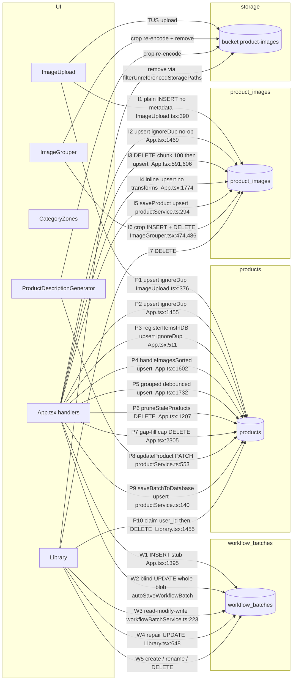

# 01 — Architecture & Data-Flow Review (Acadia)

Reviewer: incoming senior engineer. Read-only pass over `src/` (48,622 LOC, 108 TS/TSX files),
`supabase/migrations/` (45 files), `supabase/functions/` (2), `dist/` (existing build).
Baseline: `main` @ `0cdfacd`. `npm test` → **19 files / 229 tests, all passing, 852 ms**.
`npx eslint src` → **309 problems** (293 errors), 228 of them `no-explicit-any`.

Companion to `AGENTS.md` (reference) and `ANALYSIS.md` (product/scaling roadmap). This document
does **not** restate either; it audits what the code actually does today, after the July 2026
Stage 2/3/4 refactors and this week's founder tools (analytics, CRM, support, kanban).

---

## 1. Top findings

Every row was verified by reading the cited lines. Paths relative to repo root.

| # | Sev | File:line | Issue | Proposed change | Eff | Regression risk |
|---|-----|-----------|-------|-----------------|-----|-----------------|
| 1 | **critical** | `supabase/migrations/support_messaging.sql:94` + `:111-114` | `grant update (subject, status, user_last_read_at, founder_last_read_at)` to `authenticated`, and the UPDATE policy passes for `user_id = auth.uid()`. Any user can stamp `founder_last_read_at` on their own thread — suppressing the founder inbox unread badge (`supportService.ts:160`, `SupportWidget.tsx:314`) — or set `status='closed'` on their own ticket. `markThreadRead(threadId, role)` takes the role from the client (`supportService.ts:123`). | Drop `status` + `founder_last_read_at` from the authenticated column grant; add a second policy/RPC so only `is_beta_admin()` moves the founder stamp. | S | None (tightening; client already handles failures silently). |
| 2 | **critical** | `App.tsx:1885` vs `workflowBatchService.ts:223-240` | Two unsynchronised writers to the same `workflow_batches.workflow_state` blob: App's auto-save does a blind whole-blob UPDATE; Library's delete path does a read-modify-write. Deleting an image/group in Library for the **active** batch does not tell App, so the in-memory store re-writes the deleted item within 2 s ("resurrection"). `onBatchDeleted` exists for whole batches (`Library.tsx:70`) but there is no item-level equivalent. | Add `onItemsDeleted?(ids: string[])` to `LibraryProps`, wired to a store-prune in App (mirror of `handleBatchDeleted`, `App.tsx:1296`). Longer term: finish Stage 4c so the blob stops being authoritative. | S | Low — additive callback. |
| 3 | **high** | `ProductDescriptionGenerator.tsx:720` (loop from `:692`) and `:885` | `applyPresetToProductGroup` is called once **per group** inside a `for` loop, and again per group navigation. Each call does its own uncached `getCategoryPresets()` round trip (`categoryPresetsService.ts:9-21`). 100 groups ⇒ 100 sequential Supabase fetches on Step-3 mount. This is the exact defect fixed in `CategoryZones` (commits `55a46f0`, `b0a41a6`) — PDG never got the fix, even though it already holds `availablePresets` (`:97`, loaded at `:657`). | Extract `resolvePreset(presets, categoryName, opts)` (see §8.2) and call `applyPresetDirectly` with the already-loaded list. Zero network calls. | M | Low if the resolver reproduces the current match order exactly (test-locked). |
| 4 | **high** | `ImageUpload.tsx:384-390` vs `App.tsx:1469-1477` | The per-chunk **plain INSERT** writes only `product_id/user_id/image_url/storage_path` and runs first. App's correct `buildProductImageRow` upsert then no-ops (`ignoreDuplicates: true` on the `(product_id, image_url)` unique index, `fix_product_images_unique_index.sql:9-10`). Net effect: `original_name`, `position`, `alt_text`, `transforms`, `captured_at` are **never** written at upload time — they only appear after a batch reopen runs `registerItemsInDB`. | Make the per-chunk write use `buildProductImageRow` (`imageRowSync.ts:72`) and delete the redundant upsert in `handleImagesUploaded`. | S | Low — one writer instead of two, same conflict key. |
| 5 | **high** | `App.tsx:917-931` | Unconditional `console.log` of a 13-key object **per item** inside `mergeDB`, on every page load. 800-image batch ⇒ 800 console entries plus retained object graphs in devtools. | Route through `log.app` (already imported, `App.tsx:7`) or delete. | S | None. |
| 6 | **high** | `ProductDescriptionGenerator.tsx:256-281` | The 500 ms debounced `syncGroupFieldsToDatabase` effect keys on `[processedItems]` — i.e. on **every** store mutation, including Step-2 grouping, categorising, DB hydration and the EXIF patch. PDG is mounted as soon as `sortedImages.length > 0` (`App.tsx:2884`), so a Step-2 group click writes whatever Step-3 group index 0 currently holds back to `products`. | Gate the effect on a user-edit signal (`pendingSaveGroupRef`, already at `:113`) instead of raw array identity; keep `debouncedDirectSave` as the only save trigger. | M | Medium — this is the path that fixed the June-2026 persistence saga; must be locked by a test first. |
| 7 | **high** | `App.tsx:1819-1835` | `autoSaveWorkflow` does a **synchronous** `JSON.stringify` of the whole item list into `localStorage` on every call, and it is called from `handleItemsProcessed` (`:1790`), which fires from PDG's `[processedItems]` effect (`:241`) on every mutation. Main-thread stall grows linearly with batch size, per keystroke. | Debounce the backup (100–200 ms) or move to `requestIdleCallback`; the stated purpose (survive an immediate refresh) tolerates 200 ms. | S | Low. |
| 8 | **high** | `vite.config.ts:10-14`; `App.tsx:36`; `OrgPanel.tsx:25-26` | No `manualChunks`, and **zero `React.lazy` in the whole repo**. `dist/assets/index-C5V_uDCS.js` = **1,243,045 bytes**. Founder-only `KanbanBoard` (878 lines + `src/lib/kanban/*`), `AnalyticsPanel`, `CrmPanel` are statically imported and shipped to anonymous landing-page visitors. | `lazy()` the four modals (Kanban, Analytics, Crm, VocabDashboard); move `an-*`/`ft-*`/`crm-*` rules out of `OrgPanel.css` into the lazy components. | M | Low (Suspense fallback only). |
| 9 | **high** | `ImageGrouper.tsx:65-69`, `:1013-1084` | A **third** copy of the item list (`groupedItems` + `groupedItemsRef`) reconciled against props by a ~70-line heuristic with comments like *"do NOT overwrite with incoming imageUrls from props, which may be corrupted by App.tsx merge operations"* (`:1054-1055`) plus `pathChanged` / `uploadJustFinished` / `existingIsBlob` special cases. This is precisely the machinery Stage 2b deleted from PDG. | Migrate ImageGrouper to `useStoreItemArray('groupedImages')` + `liveArrayRef`, delete `initializeItems`' merge branch. | L | High — needs characterization tests on grouping/undo/pick first. |
| 10 | **high** | `App.tsx:2129-2200` ≡ `App.tsx:2216-2289` | Two **byte-identical** 70-line DB-row→`ClothingItem` builders (verified: `diff` of the two ranges differs only in the assignment line). A field added to one is silently missing from the other. | Extract `productRowToClothingItem` (see §8.3). | S | None (pure extraction, diff-provable). |
| 11 | **high** | `App.tsx:938-989` vs `:2378-2441` | The same 45-field DB→item **merge** written twice; the startup copy appends `\|\| ''` to string fields, the open-batch copy does not. So the two restore paths disagree on empty-vs-undefined for ~30 fields. | Single `mergeProductRowIntoItem(item, row)` (see §8.3); pick one empty-string policy deliberately. | M | Low-medium (the `\|\| ''` divergence is itself a latent bug). |
| 12 | medium | 24 inline `getPublicUrl(` sites (12 in `App.tsx` alone: `:540, 689, 847, 1059, 1681, 1759, 1981, 2138, 2226, 2372, 2376`) vs the lone wrapper `productService.ts:15-17` | `storagePath → URL` is the seam ANALYSIS §4 Phase 1b calls "one function swap" for the private-bucket migration. It is currently 24 swaps, three of them async-hostile (`createSignedUrl` returns a promise). | One `lib/storageUrls.ts` module (§8.1); all call sites route through it. | M | None (mechanical). |
| 13 | medium | `workflowBatchService.ts:10-16` + `:34` vs `slimItems.ts:20-36` | Two diverged definitions of the persisted slim item: `SlimItem` (5 fields) is what the `WorkflowBatch` type claims is in the blob; `SlimWorkflowItem` (15 fields) is what is actually written. Consumers paper over it with `as ClothingItem[]` (`App.tsx:1969`, `Library.tsx:642-645`). | Delete `SlimItem`; type `workflow_state.processedItems` as `SlimWorkflowItem[]` and make the restore path an explicit widening function. | M | Low — will surface real type errors worth fixing. |
| 14 | medium | `workflowBatchService.ts:98-101`, called at `Library.tsx:244` | `select('*')` on `workflow_batches` with **no limit, no org filter, no pagination** — pulls every batch's full `workflow_state` blob on every Library open. Silently truncates at PostgREST's 1000-row cap. `fetchWorkflowBatchesMeta` (`:119`) already proves the cheap projection is available. | Fetch blobs per-expanded-batch (lazy), or paginate with `range()` like `fetchSavedProducts`. | M | Low. |
| 15 | medium | `ImageGrouper.tsx:2051-2072` → `App.tsx:2802` | `onActionsReady` builds a new object on every `selectedItems` change and pushes it into App state (`setGrouperActions`). Every click in Step 2 re-renders the App root, hence PDG (3,248 lines, `useMemo` over the whole list) and the exporter pipeline. | Keep the action bag in a ref + expose `selectedCount` via a narrow subscription, or move the toolbar back inside ImageGrouper. | M | Low. |
| 16 | medium | `GoogleSheetExporter.tsx:116, 148, 212, 224` + `App.tsx:2968-2972` | The coalesce → title-dedup → price-gate pipeline has **no `useMemo`**, and App passes a freshly-built array literal each render. The whole O(groups × fields) pipeline plus a 63-column preview re-runs on every unrelated App render (see #15). | `useMemo` the pipeline on `[items, existingTitles, gidOverrides, vendorName]`; memo the `items` prop in App with `filterStep3Visible`. | S | None. |
| 17 | medium | `App.tsx:1756-1771` | This fourth `product_images` writer hand-builds rows and omits `transforms` / `captured_at`, contradicting the invariant `imageRowSync.ts:6-18` states it enforces ("one row builder shared by every product_images write path"). | Call `buildProductImageRow`. | S | None. |
| 18 | medium | `CrmPanel.tsx:70-74` → `crm.sql:158-206` | `crm_sync_contacts()` — a nested PL/pgSQL loop over all of `beta_signups` **and** all of `auth.users`, one UPDATE per row — runs on **every** panel mount, and again on every beta approve/deny (`OrgPanel.tsx:361`). Cost grows with total user count. | Sync on an explicit "Refresh" button + a scheduled job; drop the mount-time call. | S | Low. |
| 19 | medium | `App.tsx:3043` + `SupportWidget.tsx:19, 93` + `supportService.ts:144-145` | `SupportWidget` mounts for every signed-in user with a 45 s poll refetching up to 300 threads + 500 messages; the realtime handler ignores the payload and triggers a full refetch, so every message and every read-stamp UPDATE fans out two queries to all subscribers. | Use the realtime payload; poll only while the panel is open. | M | Low. |
| 20 | medium | `analytics_events.sql:45, 51-52, 149-151` | `anon` INSERT with no rate limit and no cap on the number of `props` keys (`analytics.ts:124-128` caps lengths only); `analytics_prune()` exists but is wired to nothing (no `pg_cron`) so the table grows unbounded behind 3 indexes. | Schedule `analytics_prune()`; cap `props` key count client-side and add a per-session insert budget. | S | None. |
| 21 | medium | `Library.tsx:22-64` vs `src/components/LazyImg.tsx` | Library reimplements `LazyImg` locally **without** the 3× retry/backoff + cache-bust that exists to survive `ERR_QUIC_PROTOCOL_ERROR`. Library thumbnails therefore lack the fix the rest of the app has. | Delete the local copy; import the shared one. | S | Low (visual only). |
| 22 | medium | `App.tsx:1103-1127` | A one-time-per-browser cleanup issues three unfiltered `DELETE FROM product_images WHERE storage_path LIKE '%<prefix>%'`. Hard-coded 2024-era timestamp prefixes, guarded only by a localStorage key. Under org RLS this now runs once per tenant, per browser. | Delete the block; if still needed, run it once as SQL. | S | None (it is a no-op today). |
| 23 | low | 292 raw `console.*` in 18 files (`ImageGrouper.tsx` 62, `App.tsx` 36, `PDG` 29, `exportLibraryService.ts` 25, `libraryService.ts` 23) alongside the gated `debugLogger` | Two logging systems; the ungated one runs in production. `ImageGrouper.tsx:1395` even ships a `console.table`. | Sweep to `log.*`; add an ESLint `no-console` rule with a `debugLogger.ts` exemption to stop the drift. | M | None. |
| 24 | low | `src/components/{SavedProducts,TestLlamaVision,LiveWorkspaceSelector,RemoteCursors,AISettings,ImageSorter}.tsx`, `src/hooks/useUserPresence.ts`, `src/services/api.ts`, `src/lib/huggingfaceService.ts`, `src/lib/exportLibraryService.ts` | 2,463 lines with **zero importers** (verified). They are tree-shaken out of the bundle, but they are still type-checked, linted (contributing to the 309), and read by every agent and human onboarding. | Delete. Git history keeps them. | S | None. |

---

## 2. Architecture as it actually is

### 2.1 Layers

```
main.tsx ──► App.tsx (root; no router, no Context, no Provider)
├── STEPS      ImageUpload ▸ ImageGrouper+CategoryZones ▸ PDG ▸ GoogleSheetExporter
│   MODALS     Library · Categories · CategoryPresets · OrgPanel(+Analytics/Crm) ·
│              VocabDashboard · KanbanBoard · WaitlistGate · Landing · SupportWidget
├── SHARED STATE   lib/workflowStore.ts — useSyncExternalStore, 127 lines, no library
├── PURE DOMAIN (tested — the healthy layer)  slimItems · grouping · libraryData ·
│      csvExport · imageRowSync · applyPresetToGroup · descriptionSettings ·
│      analytics · crmService · supportService · kanban/{tree,rank,atlas,dates,…}
├── DATA ACCESS (thin, per-table, raw supabase-js; no repository, no cache)
│      workflowBatchService · productService · libraryService · categoriesService ·
│      categoryPresetsService · orgService · betaService · vocabService ·
│      shopifyConnectionService · storageSafety · tusUpload · imageTransforms
├── KNOWLEDGE BASES (~10k lines of static data)  vintagePatternEngine +4 expansions ·
│      brandCategorySystem · colorDatabase · construction/fitCondition · textAIService
└── SERVER (all of it)  functions/shopify-titles · functions/generate-prose
```

The pure layer is genuinely good and holds all 229 tests. Everything above it is four god
components (`App.tsx` 3,065 · `PDG` 3,248 · `ImageGrouper` 3,125 · `Library` 2,829 = **12,267 LOC
with zero test coverage**) that also contain most of the data-access calls.

### 2.2 Ownership of every piece of state

| Where it lives | What lives there | Notes |
|---|---|---|
| **`workflowStore`** (`lib/workflowStore.ts:43-49`) | `uploadedImages`, `groupedImages`, `sortedImages`, `processedItems`, `currentBatchId` (declared but **unused** — App keeps its own) | Read by App via `useStoreItemArray` (`App.tsx:264-267`) and by PDG (`PDG:89`). `liveArrayRef` views (`App.tsx:30-33`, `PDG:24`) replaced the ref mirrors. |
| **App `useState`** (24 hooks) | `user`, `loading`, `currentOrg`, `orgRole`, `orgDescSettings`, `betaWaitlist`, `showLogin`, 6 modal flags, `selectedGroupItems`, `grouperActions`, `saving`, `saveMessage`, `libraryRefreshTrigger`, `toasts`, `storageInfo`, `currentBatchId`, `currentBatchNumber`, `debugEnabled` | Every one of these re-renders the entire 4-step tree. |
| **App `useRef`** (14) | `currentBatchIdRef`, `isOpeningBatchRef`, `autoSaveTimerRef`, `autoSaveInFlightRef`, `groupUpsertTimerRef`, `pendingChunkRef`, `chunkTimerRef`, `batchRowInsertedRef`, `isUploadingRef`, `showLibraryRef`, `grouperActionsRef`, `toastCounterRef`, `exporterRef`, `uploadRef` | The concurrency-control layer. Mostly mutexes and debounce handles. |
| **ImageGrouper local** (43 `useState`, 33 `useRef`) | **A second copy of the item list** (`groupedItems`, `:65`) + undo/redo stacks, selection, rubber-band, pick mode, sort/filter, crop modal, lightbox, manual order | The last un-migrated duplicate. |
| **PDG local** (34 `useState`, 17 `useRef`) | `currentGroupIndex`, recording state, presets, crop/lightbox/magnifier, chips, brand terms, `hasUnsavedChanges` | No item copy any more (Stage 2b). |
| **Library local** (27 `useState`) | `batches`, `productGroups`, `images` — fetched independently of App; selection, collapse, delete progress | Its own data island; communicates back only via `onOpenBatch`/`onBatchDeleted`. |
| **`localStorage`** | `sortbot_current_batch_id`, `sortbot_current_batch_number`, `sortbot_workflow_backup` (App), `sortbot_deleted_batch_ids` (tombstones, `workflowBatchService.ts:54`), `sortbot_compressed_paths` (ImageUpload), `sortbot_debug_enabled`, `sortbot_orphan_cleanup_v3` | Effectively a second database for session identity and crash recovery. |
| **`sessionStorage`** | analytics session id + last view (`analytics.ts:71-81`, `:168`) | Per-tab, cookieless by design. |
| **Postgres** | `workflow_batches` (incl. the `workflow_state` JSONB), `products`, `product_images`, `categories`, `category_presets`, `organizations`/`org_members`/`org_invites`, `beta_signups`, `analytics_events`, `crm_*`, `support_*`, `kanban_*`, `vocab_*`, `org_shopify_connections` | |
| **Storage** | public bucket `product-images`, paths `{userId}/{productId}/{ts}-{rand}.ext` | Still **public** and keyed by user, not org. |

**The unresolved question the architecture never answers: is the truth the JSONB blob or the
relational tables?** Today it is both, reconciled by heuristics (gap-fill cap `App.tsx:2213`,
±24 h orphan window `:2092`, stolen-row deletion `:2299-2308`). Stage 4a/4b shipped the dual-write;
4c (flip the read) has not.

### 2.3 The complete core path

**(1) File drop → upload.** `ImageUpload` (react-dropzone / `webkitdirectory` / JSZip) → EXIF
`DateTimeOriginal` per file (`getCapturedAt`) → sort by `capturedAt` → canvas compress (2000 px /
q 0.88) → TUS upload in chunks of 10 (`tusUpload.ts`, dynamic import) → per chunk: `products`
upsert then `product_images` **plain INSERT** (`ImageUpload.tsx:376, 390`) → `onChunkReady` up to
App.

**(2) Chunk intake.** `handleUploadStart` (`App.tsx:445`) mints the batch UUID synchronously into
`currentBatchIdRef` + localStorage. `handleChunkReady` (`:455`) coalesces chunks behind a 150 ms
timer and appends to `uploadedImages` (plus the other three arrays if a batch is already open).

**(3) Upload complete.** `handleImagesUploaded` (`:1366`) dedups against `uploadedImagesRef`,
INSERTs the `workflow_batches` stub row **once** (`:1395`, guarded by `batchRowInsertedRef`) so the
later blind UPDATE has a row to hit, fires `autoSaveWorkflow`, then re-upserts `products` +
`product_images` (`:1455`, `:1469`) — the second of which is a no-op (finding #4).

**(4) Grouping.** `ImageGrouper` copies props into its own `groupedItems`, mutates locally,
calls `onGrouped` → `handleImagesGrouped` (`App.tsx:1617`): re-applies categories from
`groupedImagesRef`, prunes deletions out of `uploadedImages`, rebuilds `sortedImages`, merges into
`processedItems` (preserving preset/user fields), rebuilds every item's URLs from `storagePath`
(`:1679-1689`), fires `autoSaveWorkflow`, and schedules a 2 s debounced chunked `products` upsert +
`product_images` upsert + `pruneStaleProducts` (`:1723-1787`).

**(5) Categorise / preset.** `CategoryZones` resolves a preset from already-loaded state
(`findPreset`, `:199`) and applies it synchronously (`applyPresetDirectly`) → `onCategorized` →
`handleImagesSorted` (`App.tsx:1525`): sets `sortedImages` + `groupedImages`, merges into
`processedItems` under a 42-name `userFields` whitelist (`:1551-1567`), auto-saves, and upserts
`product_category` + `product_group` (`:1602`).

**(6) Step 3 edits.** PDG reads the same store list, derives display groups with
`buildGroupArray` (tolerant group-id rule + Step-3 visibility filter, `grouping.ts:37`). Voice →
`extractFieldsFromVoice`; Generate → `generateProductDescription` (+ optional `generate-prose`
Edge Function). Writes go out three ways: `debouncedDirectSave` (800 ms, `:127`), the
`[processedItems]` effect (500 ms, `:263`) and a `beforeunload`/`pagehide` flush (`:284`) — all
three through the **same** `productSaveTimerRef`, so whichever schedules last wins.

**(7) Auto-save.** `autoSaveWorkflow` (`App.tsx:1806`) writes the ultra-slim localStorage backup
**synchronously**, then debounces 2 s → `slimForWorkflowState(mostProgressedList)` → blind UPDATE
of `workflow_state` with `lastEditedBy/At`, behind `autoSaveInFlightRef` and the tombstone check.
Only one array is persisted; the other three are saved as `[]`.

**(8) Reload / restore.** Startup effect (`App.tsx:625-1097`): read `sortbot_current_batch_id` →
fetch row → `markBatchConfirmed` → pick the most-progressed array → **prefer the localStorage
backup if newer** (`:669-679`) → rebuild `preview`/`imageUrls`/`thumbnailUrl` from `storagePath` →
backfill `original_name` (chunked 100) → two-stage DB image fallback (by id, then by
`productGroup` peers) → set all four arrays → fire-and-forget DB hydration (`mergeDB`, 45 fields)
→ auto-EXIF rescan if ≤ 30 items lack `capturedAt`.

**(9) Library.** Opens as a modal, fetches independently: `fetchWorkflowBatchesMeta` (fast list)
then in parallel `fetchWorkflowBatches` + `fetchSavedProducts` + `fetchSavedImages`, all fed to the
pure `deriveLibraryData` (two-pass dedup by `product_id`, gap-fill, batch synthesis). Clicking a
batch → `handleOpenBatch` (`App.tsx:1916`, ~640 lines): sets identity, clears state, hydrates from
the blob, fetches `products` by `batch_id` (or the ±24 h orphan window), rebuilds items from the DB
if the blob is empty, gap-fills (or deletes above the cap), merges by `productGroup` → image URL →
title, then background `registerItemsInDB` + EXIF rescan.

**(10) CSV export.** `GoogleSheetExporter` receives the Step-3-visible subset, groups by
`productGroup`, orders by earliest `capturedAt`, coalesces each field across the whole group
(`:157-164`), picks/builds a title, dedups against the export + the `products` table + the live
Shopify catalog (`shopify-titles`), blocks on any $0 price, then `buildShopifyCsv` (pure,
golden-tested) → Blob download.

### 2.4 Write paths per table



**Who is authoritative for what** (derived from the conflict keys and the merge precedence):

| Column / concern | Authoritative writer | Everyone else |
|---|---|---|
| `product_images.image_url` + `storage_path` | `ImageUpload.tsx:390` (first insert wins — unique index) | I2/I4 skip; I3 wipes + rewrites on batch open |
| `product_images.original_name`, `position`, `alt_text`, `transforms`, `captured_at` | `registerItemsInDB` (`App.tsx:606`) — **only on batch open** | never written at upload (finding #4) |
| `products.batch_id` | `ImageUpload.tsx:376` at upload | all others use `ignoreDuplicates: true` **except** P4 (`:1610`) and P5 (`:1741`), which do overwrite it |
| `products.product_group` | P4/P5 (App, debounced) | P1/P2/P3 set `item.id` as a placeholder |
| all editorial fields (title/desc/price/…) | `updateProduct` from PDG (`productService.ts:553`) — group **leader only** | `saveProductToDatabase` on explicit Save Batch |
| grouping + category + crop + `capturedAt` | `workflow_state` blob (W2) | dual-written to `products`/`product_images` since Stage 4, **not yet read back** |
| deletion of items | Library (W3 + P10 + I7) | App's store is never notified (finding #2) |

---

## 3. Bad architectural decisions (and what they cost today)

1. **Two sources of truth for the same items — a JSONB blob and the relational tables — with no
   version, no reconciliation log, and heuristics as the tie-breaker.** Cost: `handleOpenBatch` is
   640 lines of which ~300 exist only to reconcile the two copies; three of those heuristics
   **delete rows** (`App.tsx:2299-2308`, `:1207`, `:1115-1119`). Every new persisted field requires
   edits in five places (`slimItems.ts`, both DB→item builders, both merges). ANALYSIS already
   prescribes 4c/4d; nothing else in this document matters as much.

2. **The blob's shape is a whitelist in one module, but its *type* is declared in another and is
   wrong.** `slimForWorkflowState` writes 15 fields; `WorkflowBatch.workflow_state.processedItems`
   is typed `ClothingItem[] | SlimItem[]` where `SlimItem` has 5. Every consumer therefore casts
   `as ClothingItem[]` and then reads fields that are provably absent (`item.preview`,
   `item.seoTitle` in `libraryData.ts:148, 234`). The compiler cannot help with the single most
   fragile contract in the app.

3. **`ClothingItem` is one flat 60-field type used as upload record, grouping node, editable
   listing draft, CSV row, and persistence shape.** `file: File` is non-optional (`App.tsx:78`) yet
   is `null as any` in both DB rebuild paths (`:2149`, `:2237`). Preset-owned, user-owned and
   DB-owned fields are indistinguishable, which is why the merge logic needs a hand-maintained
   42-name whitelist (`:1551-1567`) and a hand-maintained 27-name `PRESET_OWNED` list (`:414-421`)
   — two lists that must stay in sync with each other and with `applyPresetFields`.

4. **Every cross-component signal is App state, so every signal re-renders all four steps.**
   Selection count (`grouperActions`), selected ids, `libraryRefreshTrigger`, toasts, storage meter.
   `libraryRefreshTrigger` is incremented from 7 sites (`App.tsx:1239, 1482, 1612, 1785, 2535,
   2799`) but is only *read* by a component that is unmounted unless the modal is open.

5. **No route/URL state at all.** Steps are `length > 0` predicates (`App.tsx:2884`, `:2940`), so
   Step 3 mounts as soon as anything is grouped and its save effects start firing during Step 2
   (finding #6). There is no way to deep-link a batch, and the browser Back button is meaningless.

6. **Debounce and chunking are re-invented per call site.** The constant 100 (PostgREST URL limit)
   is declared under six different names in six files (`DELETE_CHUNK_SIZE`, `CHUNK`, `OCHUNK`,
   `CLAIM_CHUNK`, plus two bare literals at `App.tsx:714`, `:757`). Debounce windows are
   150/300/500/800/1000/2000/4000 ms hand-rolled in three components, and `productSaveTimerRef`
   is shared by two different debounce windows (800 ms and 500 ms) that clobber each other.

7. **Public storage bucket keyed by `userId`, after tenancy was modelled by `org_id`.** Storage is
   now the one layer where the tenancy boundary does not exist — and moving a user between
   workspaces (`founding_move_user`) does not move their storage prefix.

8. **Migrations are 45 hand-run SQL files (plus 4 at repo root) with no ordering metadata and no
   applied-state tracking.** The code compensates with runtime feature probes
   (`stage4ColumnsAvailable`, `orgService` legacy mode, `getShopifyConnection` 'unavailable'). That
   is genuinely clever forward-compatibility, but it means the app's behaviour depends on which
   SQL someone remembered to paste, and nothing can tell you which state production is in.

9. **Errors are swallowed by default.** `productService.ts:246-248, 321-323` return `null` on
   failure with no log; `GrouperErrorBoundary` (`App.tsx:210-231`) is the only boundary and it
   exists to hide render errors. The result is that the persistence bugs in AGENTS.md §15 could
   only be discovered by a user noticing missing data.

---

## 4. Duplicate logic (and which copy should survive)

| # | Duplicate | Locations | Keep |
|---|---|---|---|
| 1 | **DB row → `ClothingItem`** — byte-identical 70 lines | `App.tsx:2129-2200`, `App.tsx:2216-2289` | New `lib/productRow.ts` (§8.3). |
| 2 | **DB row merged into an existing item** — same 45 fields, divergent `\|\| ''` | `App.tsx:938-989` (startup, with `\|\| ''`), `App.tsx:2378-2441` (open batch, without) | Same module; pick the open-batch semantics (`undefined` stays `undefined`). |
| 3 | **`storagePath` → CDN URL** | 24 sites; `App.tsx:540, 689, 847, 1059, 1681, 1759, 1981, 2138, 2226, 2372, 2376`, `ImageGrouper.tsx:280, 459, 1248`, `Library.tsx:1708`, `libraryData.ts:155, 236`, `GoogleSheetExporter.tsx:26`, `ImageUpload.tsx:485`, `tusUpload.ts:101`, `productService.ts:16, 49, 80` | `lib/storageUrls.ts` (§8.1). `getThumbnailUrl` keeps its name as an alias; the literal `300` appears 7× and should go. |
| 4 | **Preset matcher** | `CategoryZones.tsx:199-208` (4 steps, incl. `_default` prefix), `applyPresetToGroup.ts:69-85` (3 steps) | `lib/presetResolver.ts` with an `allowDefaultPrefix` option so both current behaviours are preserved exactly (§8.2). |
| 5 | **Preset application** | `applyPresetDirectly` (sync, correct) used by `CategoryZones.tsx:213`, `App.tsx:425`, `PDG:1005, 1528`; `applyPresetToProductGroup` (async + per-call fetch) still used by `PDG:720, 885` | `applyPresetDirectly` only; delete the async wrapper once PDG migrates. |
| 6 | **Step-3 visibility filter** | `grouping.ts:26-33` (`filterStep3Visible`, tested) vs inline reimplementations at `App.tsx:2892-2894` and `App.tsx:2969-2971` | `filterStep3Visible`. |
| 7 | **`product_images` row builder** | `imageRowSync.ts:72` (canonical, Stage-4 aware) vs hand-built rows at `App.tsx:1756-1771` and `ImageUpload.tsx:384-389` | `buildProductImageRow` everywhere. |
| 8 | **Chunked `IN()` loop** | `App.tsx:565, 591, 714, 757, 1205, 1730, 2300`, `Library.tsx:1374, 1484`, `storageSafety.ts:32`, `workflowBatchService.ts:304` — 11 copies, 6 names, 1 semantics | One `lib/chunk.ts` (`export const ID_CHUNK = 100; export function chunked<T>(xs: T[], n = ID_CHUNK): T[][]`). |
| 9 | **`LazyImg`** | `src/components/LazyImg.tsx` (retry + backoff + cache-bust) vs `Library.tsx:22-64` (no retry) | The shared component. |
| 10 | **Slim item type** | `workflowBatchService.ts:10-16` `SlimItem` vs `slimItems.ts:20-36` `SlimWorkflowItem` | `SlimWorkflowItem`. |
| 11 | **Founding-admin check, inlined 6×** | `App.tsx:2597, 3014, 3047`, `OrgPanel.tsx:84`, + `is_beta_admin()` server-side | One `isFoundingAdmin(org, role)` helper in `orgService.ts`. |
| 12 | **`fmtDate`, byte-identical** | `CrmPanel.tsx:29-30`, `OrgPanel.tsx:47-48` (and OrgPanel renders CrmPanel) | One `lib/format.ts`, together with `compactNumber` (`analytics.ts:302`), `formatRelative` (`supportService.ts:180`), `todayKey` (`crmService.ts:226`). |
| 13 | **Hand-rolled debounce** | `PDG:115-135`, `ImageGrouper.tsx:1310`, `KanbanBoard.tsx:797-809` (and `CrmPanel.tsx:224, 231` which needs one and has none) | One `lib/useDebouncedCallback.ts`. |
| 14 | **AI description engine** | `textAIService.ts` (active, tested, golden snapshot) vs `services/api.ts` (OpenAI, 520 lines, never called) | `textAIService.ts`; delete `services/api.ts`. |
| 15 | **Shopify taxonomy / GID maps** | All 105 taxonomy strings now live in `csvExport.ts` only; `GoogleSheetExporter.tsx:357-360` correctly calls the shared resolvers | Already consolidated — no action. Per-store overrides via `GidOverrides` is the right seam. |

---

## 5. Performance & scalability — structural only

(A dedicated performance pass goes deeper; these are the ones caused by *shape*, not by code.)

1. **Fan-out.** `setGrouperActions` on every selection change (#15) + `libraryRefreshTrigger` +
   `selectedGroupItems` all live in App state. One click in a 800-item grid re-renders App →
   ImageGrouper (43 `useState`) → CategoryZones → PDG (`useMemo` over the full list) →
   GoogleSheetExporter (un-memoised coalesce + 63-column preview, #16).
2. **DB write frequency.** A single group click can trigger: `setProcessedItems` → PDG effect →
   `onProcessed` → `autoSaveWorkflow` (sync `JSON.stringify` of N items + 2 s debounce → blob
   UPDATE) **and** the 2 s `products` upsert (chunked 100) + `product_images` upsert +
   `pruneStaleProducts` (a full `select id` for the batch) **and** PDG's 500 ms
   `syncGroupFieldsToDatabase`. Four writers per click.
3. **`workflow_state` as a JSONB blob** means every save is a full-document rewrite — O(batch) bytes
   per keystroke-ish event, and the 1,000-batch-page cap on `fetchWorkflowBatches` (`select('*')`,
   no limit) makes the Library load O(all batches × all items) for the whole workspace.
4. **PostgREST caps and chunking** are handled correctly where they were hit (`fetchSavedProducts`/
   `fetchSavedImages` paginate 1000/page; ID lists chunk at 100) but the pattern is copy-pasted 11×
   and `fetchWorkflowBatches` was missed.
5. **N+1 network calls.** `getCategoryPresets()` per group on Step-3 mount (#3) is the worst;
   `crm_sync_contacts()` per panel mount (#18) is O(all users) *writes*; KanbanBoard refetches the
   whole board (5 queries) after every mutation and `rebalanceCards` issues one UPDATE per card.
6. **Public bucket, free tier.** No image transforms, so every grid thumbnail is a full-resolution
   download; the mitigations (Service Worker cache, `content-visibility`, `loading="lazy"`,
   compression) are all client-side workarounds for a plan limitation. Also: no tenancy boundary and
   no expiry on any image URL.
7. **Bundle.** 1.24 MB single chunk (#8), of which `builtinBrandVocab` (361 KB) and `tusUpload`
   (61 KB) are already split; the founder tools and the four big modals are not.
8. **Unbounded tables.** `analytics_events` (3 indexes, prune unwired), `support_messages`
   (no UPDATE/DELETE grant at all — no redaction path), `crm_*`, `kanban_*`.

---

## 6. Maintainability

- **God components.** 12,267 LOC across four files, all untested. `handleOpenBatch` alone is 640
  lines with a `try` that spans 450 of them (`App.tsx:2019-2465`).
- **Implicit contracts that only a comment enforces.** `slimForWorkflowState`'s whitelist
  (`slimItems.ts:38`) is the save→reload contract and is at least tested. The ones that are *not*:
  the `userFields` whitelist (`App.tsx:1551`), `PRESET_OWNED` (`:414`), the leader-id convention,
  "match by `productGroup` first, never by position" (`:2332-2350`), and "call
  `filterUnreferencedStoragePaths` **before** deleting rows" (`storageSafety.ts`).
- **Ref-mirror remnants.** The four App mirrors are now live store views (good), but
  `ImageGrouper.tsx:68-69` (`groupedItemsRef`), `:172` (`photoSelectModeRef`), `:211`
  (`pickModeRef`), `:214` (`advancePickSelectionRef`), `:664-678` (six rubber-band mirrors),
  `App.tsx:271` (`grouperActionsRef`), `:276` (`showLibraryRef`) and `PDG:142-145` are all still the
  old pattern — each one an invitation to the stale-closure bug class the store was built to kill.
- **Type holes.** 228 `no-explicit-any`; `App.tsx` alone has 51 `: any` + 8 `as any` + 5
  `as ClothingItem[]`. The load-bearing ones are the slim-blob casts (`App.tsx:1969`,
  `Library.tsx:642-645`, `libraryData.ts:148,153,157,234,235,238,244`) and `file: null as any`.
- **Logging drift.** 292 raw `console.*` beside a purpose-built gated logger; `PDG:116`/`:130`
  and `App.tsx:917` log per-item objects in production.
- **Test coverage gaps, in priority order:** grouping/selection/undo inside `ImageGrouper`; the
  restore paths (`handleOpenBatch`, startup) — the code that *deletes rows*; the merge whitelists
  (`userFields`, `PRESET_OWNED`); `registerItemsInDB`'s delete-then-upsert ordering; any component
  test at all (there are zero, and no Playwright smoke run).
- **Documentation debt of a different kind:** `AGENTS.md` is 1,059 lines and states several things
  the code has since contradicted (three `product_images` writers — there are six; "all three share
  `buildProductImageRow`" — two do not). The doc is the map; it needs the same review discipline as
  the code, or agents will keep trusting it over the source.

---

## 7. Refactoring plan

### Already done (do not redo)
`workflowStore` + Stage 2a/2b (four arrays in the store, ref mirrors → live views, PDG's duplicate
copy and `isResettingRef` deleted) · `csvExport.ts` (+ golden test) · `libraryData.ts` (+12 tests) ·
`slimItems.ts` (+ roundtrip tests) · `grouping.ts` (+7 tests incl. the 42→11 reproduction) ·
`imageRowSync.ts` (Stage 4 dual-write, feature-probed) · `applyPresetToGroup` extraction ·
`analytics`/`crmService`/`supportService`/`kanban/*` pure logic with tests.

### Next 5 steps, in order

**Step 1 — Seam modules: `storageUrls` + `chunk`.** *(S, ~2 h)*
Files: new `src/lib/storageUrls.ts`, new `src/lib/chunk.ts`; edits to `App.tsx` (12 URL + 7 chunk
sites), `ImageGrouper.tsx` (3), `Library.tsx` (3), `libraryData.ts` (2), `productService.ts` (3),
`ImageUpload.tsx`, `GoogleSheetExporter.tsx`, `tusUpload.ts`, `storageSafety.ts`,
`workflowBatchService.ts`.
Moves: nothing but the expression `supabase.storage.from('product-images').getPublicUrl(p).data.publicUrl`
and the `for (let i = 0; i < ids.length; i += 100)` loop.
Test that locks it: new `storageUrls.test.ts` (URL shape for a path, `''` for empty) +
`chunk.test.ts` (exact partitioning incl. 0/1/100/101 elements). `libraryData.test.ts` and
`csvExport.test.ts` already cover downstream behaviour.
Why first: zero risk, and it converts the private-bucket migration (ANALYSIS Phase 1b) from 24
edits into one.

**Step 2 — `lib/productRow.ts`: one DB→item builder and one merger.** *(S–M, ~4 h)*
Files: new `src/lib/productRow.ts`; `App.tsx` loses ~230 lines (`:938-989`, `:2129-2200`,
`:2216-2289`, `:2378-2441`).
Moves: `productRowToClothingItem(row)` (the byte-identical builder) and
`mergeProductRowIntoItem(item, row, opts)` (the 45-field merge, with the `|| ''` divergence made an
explicit option so both current behaviours are reproducible).
Test that locks it: new `productRow.test.ts` — one fixture row → exact expected item (snapshot);
merge precedence (`row` wins for present values, `item` for null/undefined, `??` vs `||` fields
enumerated); and one test asserting the two builder call sites produce identical output for the same
row (the invariant that was true by accident and is now enforced).

**Step 3 — `lib/presetResolver.ts` + PDG de-N+1.** *(M, ~1 day)*
Files: new `src/lib/presetResolver.ts`; `PDG` (`:670-782`, `:787-945`), `CategoryZones.tsx:199-215`,
`applyPresetToGroup.ts` (delete `applyPresetToProductGroup` once unused).
Moves: the two matchers into one option-parameterised resolver; PDG's per-group loop switches to
`availablePresets` + `applyPresetDirectly`.
Test that locks it: extend `applyPresetToGroup.test.ts` with a `resolvePreset` suite covering the
exact 3-step order (product_type+default → product_type → category_name) and the 4th step behind
`allowDefaultPrefix`, plus "no match ⇒ undefined" (so callers keep doing plain category assignment).
Payoff: Step-3 mount goes from O(groups) network round trips to zero.

**Step 4 — split `handleOpenBatch` + startup restore into `lib/batchRestore.ts`.** *(L, ~3 days)*
Files: new `src/lib/batchRestore.ts`; `App.tsx` sheds ~900 lines (`:625-1097`, `:1916-2553`).
Moves, as pure functions with the Supabase calls injected: `hydrateFromWorkflowState(rawItems)`,
`chooseRestoreSource(blob, backup, batchMeta)`, `gapFill(baseItems, dbRows, cap)` **including the
cap decision and the stolen-id list it returns** (so the delete becomes the caller's explicit act,
not a side effect buried in a 640-line function), and `mergeSavedProducts(baseItems, rows)`.
Test that locks it: new `batchRestore.test.ts` — the fallback chain (`processedItems → sortedImages
→ groupedImages → uploadedImages`), backup-is-newer preference, gap-fill under the cap, gap-fill
over the cap returns `{ items, stolenIds }` and adds nothing, and the `productGroup`-first match
order (the `3a70b52` "mixed-up images" regression).
This is the step that makes Stage 4c (flip the read to DB-first) a contained change instead of
surgery.

**Step 5 — migrate `ImageGrouper` to the store.** *(L, ~1 week, and only after Step 4)*
Files: `ImageGrouper.tsx` (delete `groupedItems`/`groupedItemsRef`/`initializeItems`'s merge
branch, ~250 lines), `App.tsx:1617-1788` (`handleImagesGrouped` collapses to the DB sync — the
category/URL re-merge exists only because ImageGrouper's copy can diverge).
Moves: `useStoreItemArray('groupedImages')` + `liveArrayRef`; the undo/redo stacks stay local but
snapshot the store slice.
Test that locks it: new `grouperActions.test.ts` over extracted pure helpers —
`createGroup(items, selectedIds)` (leader convention), `ungroup`, `autoGroup(items, n)`,
`deleteSelected`, `applyManualOrder` — reproducing `grouping.test.ts`'s 42-image/11-group fixture
end-to-end through the action layer. Plus the first component test (`@testing-library/react`) for
select → group → assert store contents.
Payoff: the last duplicated item list dies, and with it the "props may be corrupted" heuristics.

Deliberately *not* in the top 5, but next: finding #6 (PDG save-effect gating) needs Step 3's tests
under it first; the `ClothingItem` split into `UploadRecord | ListingDraft | PersistedItem` is the
right end state but is a month of work and should follow Stage 4c.

---

## 8. Production-grade code for the top 3 refactors

Not applied to the tree. Behaviour-identical by construction.

### 8.1 `src/lib/storageUrls.ts` (new)

```ts
import { supabase } from './supabase';

/**
 * storageUrls — THE single seam between a Supabase Storage path and a URL the
 * browser can load.
 *
 * WHY THIS EXISTS: `storagePath` is the only image reference that survives
 * slimForWorkflowState (AGENTS.md §11), so every restore path has to turn paths
 * back into URLs. That expression was inlined at 24 call sites, which made the
 * planned public→private bucket migration (ANALYSIS §4 Phase 1b) a 24-site edit
 * with three different async-ness assumptions. Route everything through here and
 * it becomes one function body.
 *
 * INVARIANT: an empty/absent path yields '' — never 'undefined' in a URL, never
 * a throw. Every current call site already relies on that.
 */

export const IMAGE_BUCKET = 'product-images';

/** Full-resolution public CDN URL for a storage path. '' when there is no path. */
export function publicImageUrl(storagePath?: string | null): string {
  if (!storagePath) return '';
  return supabase.storage.from(IMAGE_BUCKET).getPublicUrl(storagePath).data.publicUrl;
}

/**
 * Card/thumbnail URL. Identical to publicImageUrl today: Supabase Storage image
 * transforms require the paid Image Transformation add-on, so the free tier must
 * serve the full-resolution object and let CSS crop it. Kept as a distinct
 * function so enabling transforms is a one-line change here, and so call sites
 * document their intent.
 */
export function thumbnailImageUrl(storagePath?: string | null, _size = 300): string {
  return publicImageUrl(storagePath);
}

/**
 * Resolve the best loadable URL for an item-like object, in the priority order
 * every restore path already uses:
 *   storagePath (authoritative — imageUrls[0] can be stale after a merge)
 *   → imageUrls[0] → a non-blob preview → ''.
 * blob: URLs are rejected: they are valid only in the session that created them
 * and 404 after any reload (AGENTS.md §18.10).
 */
export function resolveImageUrl(item: {
  storagePath?: string;
  imageUrls?: string[];
  preview?: string;
}): string {
  const fromPath = publicImageUrl(item.storagePath);
  if (fromPath) return fromPath;
  const first = item.imageUrls?.[0];
  if (first && !first.startsWith('blob:')) return first;
  if (item.preview && !item.preview.startsWith('blob:')) return item.preview;
  return '';
}
```

`src/lib/chunk.ts` (new), the other half of Step 1:

```ts
/**
 * PostgREST returns 400 once an `IN(...)` list makes the request URL too long —
 * observed at ~794 ids (AGENTS.md §11). 100 is the value every call site already
 * uses; it was just spelled six different ways (DELETE_CHUNK_SIZE, CHUNK, OCHUNK,
 * CLAIM_CHUNK, and two bare literals).
 */
export const ID_CHUNK = 100;

export function chunked<T>(xs: readonly T[], size = ID_CHUNK): T[][] {
  if (size <= 0) throw new Error('chunked: size must be > 0');
  const out: T[][] = [];
  for (let i = 0; i < xs.length; i += size) out.push(xs.slice(i, i + size));
  return out;
}
```

Call-site diff (representative; 24 + 11 sites follow the same shape):

```diff
--- a/src/lib/productService.ts
+++ b/src/lib/productService.ts
-export const getThumbnailUrl = (storagePath: string, _size = 300): string => {
-  return supabase.storage.from('product-images').getPublicUrl(storagePath).data.publicUrl;
-};
+// Re-exported for the existing 7 call sites in App.tsx; new code imports from
+// lib/storageUrls directly.
+export { thumbnailImageUrl as getThumbnailUrl } from './storageUrls';

--- a/src/App.tsx
+++ b/src/App.tsx
+import { publicImageUrl, thumbnailImageUrl } from './lib/storageUrls';
+import { chunked, ID_CHUNK } from './lib/chunk';
@@ startup restore (was :687-703)
     const liveItems = rawItems.map((item: any) => {
-      const canonical = item.storagePath
-        ? supabase.storage.from('product-images').getPublicUrl(item.storagePath).data.publicUrl
-        : '';
+      const canonical = publicImageUrl(item.storagePath);
       const imageUrls = canonical ? [canonical] : (item.imageUrls?.length ? item.imageUrls : []);
       const preview = canonical || (item.preview?.startsWith('blob:') ? '' : (item.preview || ''));
-      const thumbnailUrl = item.storagePath
-        ? getThumbnailUrl(item.storagePath, 300)
-        : (imageUrls[0] || '');
+      const thumbnailUrl = thumbnailImageUrl(item.storagePath) || imageUrls[0] || '';
       return { ...item, preview, imageUrls, thumbnailUrl };
     });
@@ registerItemsInDB (was :591-600)
-        for (let i = 0; i < productIds.length; i += DELETE_CHUNK_SIZE) {
-          const chunk = productIds.slice(i, i + DELETE_CHUNK_SIZE);
+        for (const chunk of chunked(productIds, ID_CHUNK)) {
           const { error: delErr } = await supabase
             .from('product_images').delete().in('product_id', chunk);
           if (delErr) log.error(`registerItemsInDB | product_images delete: ${delErr.message}`);
         }
```

### 8.2 `src/lib/presetResolver.ts` (new) — kills the O(groups) fetch loop

```ts
import type { CategoryPreset } from './categoryPresets';

/**
 * presetResolver — the ONE "which preset applies to this category" rule.
 *
 * There were two implementations that had silently diverged:
 *   applyPresetToGroup.ts:69-85  (3 steps) — used by ProductDescriptionGenerator
 *   CategoryZones.tsx:199-208    (4 steps) — adds the "<name>_default…" prefix
 *                                            match produced by createCategory
 * Both are preserved exactly: the 4th step is opt-in via allowDefaultPrefix, so
 * migrating PDG to this resolver cannot change which preset PDG picks.
 *
 * The important consequence is at the CALL SITES: resolvePreset is synchronous
 * and takes the preset list as an argument, so callers use the list they already
 * hold. PDG previously called the async applyPresetToProductGroup once per group
 * inside a loop, and each call issued its own uncached getCategoryPresets()
 * round trip — 100 groups meant 100 sequential fetches on Step-3 mount. That was
 * already fixed in CategoryZones (commits 55a46f0, b0a41a6); this closes it in PDG.
 */

export interface ResolvePresetOptions {
  /** Also accept a preset whose category_name starts with `<categoryName>_default`
   *  (the auto-created naming from createCategory). CategoryZones passes true. */
  allowDefaultPrefix?: boolean;
}

export function resolvePreset(
  presets: readonly CategoryPreset[],
  categoryName: string,
  { allowDefaultPrefix = false }: ResolvePresetOptions = {},
): CategoryPreset | undefined {
  if (!categoryName) return undefined;
  const lower = categoryName.toLowerCase();
  const active = presets.filter(p => p.is_active !== false);

  return (
    // 1. exact product_type match, default preferred
    active.find(p => p.product_type?.toLowerCase() === lower && p.is_default) ??
    // 2. any exact product_type match
    active.find(p => p.product_type?.toLowerCase() === lower) ??
    // 3. legacy category_name match
    active.find(p => p.category_name.toLowerCase() === lower) ??
    // 4. opt-in: the "<name>_default_<rand>" naming from createCategory
    (allowDefaultPrefix
      ? active.find(p => p.category_name.toLowerCase().startsWith(`${lower}_default`))
      : undefined)
  );
  // NO wild fallback to "any is_default preset" — that applied another category's
  // shipping defaults to unmatched categories (removed in the July 2026 audit).
}
```

Call-site diff — PDG's per-group loop (`ProductDescriptionGenerator.tsx:718-724`) and the
per-navigation auto-apply (`:885`):

```diff
--- a/src/components/ProductDescriptionGenerator.tsx
+++ b/src/components/ProductDescriptionGenerator.tsx
-import { applyPresetToProductGroup, applyPresetDirectly } from '../lib/applyPresetToGroup';
+import { applyPresetDirectly } from '../lib/applyPresetToGroup';
+import { resolvePreset } from '../lib/presetResolver';
@@ applyPresetsToAllGroups (was :718-724)
-        try {
-          // Apply preset to this group
-          const updatedGroup = await applyPresetToProductGroup(groupItems, firstItem.category);
-          updatedGroup.forEach((updatedItem) => patches.set(updatedItem.id, updatedItem));
-        } catch (error) {
-          // Silently fail for this group, continue with others
-        }
+        // availablePresets is already loaded (see the mount effect above), so this
+        // is a pure in-memory resolve — no per-group network round trip.
+        const preset = resolvePreset(availablePresets, firstItem.category);
+        const updatedGroup = preset
+          ? applyPresetDirectly(groupItems, firstItem.category, preset)
+          : groupItems.map(i => ({ ...i, category: firstItem.category }));
+        updatedGroup.forEach((updatedItem) => patches.set(updatedItem.id, updatedItem));
@@ autoApplyDefaultPreset (was :885)
-        const updatedGroup = await applyPresetToProductGroup(currentGroup, currentItem.category, categoryChanged);
+        const navPreset = resolvePreset(availablePresets, currentItem.category);
+        const updatedGroup = navPreset
+          ? applyPresetDirectly(currentGroup, currentItem.category, navPreset, categoryChanged)
+          : currentGroup.map(i => ({ ...i, category: currentItem.category }));

--- a/src/components/CategoryZones.tsx
+++ b/src/components/CategoryZones.tsx
+import { resolvePreset } from '../lib/presetResolver';
-  const findPreset = (categoryName: string) => { /* 10 lines of match order */ };
+  const findPreset = (categoryName: string) =>
+    resolvePreset(presets, categoryName, { allowDefaultPrefix: true });
```

Test to add to `src/lib/applyPresetToGroup.test.ts`:

```ts
describe('resolvePreset', () => {
  const p = (o: Partial<CategoryPreset>) =>
    ({ is_active: true, is_default: false, category_name: '', ...o }) as CategoryPreset;

  it('prefers an exact product_type match that is default', () => {
    const list = [p({ id: 'a', product_type: 'tees' }), p({ id: 'b', product_type: 'Tees', is_default: true })];
    expect(resolvePreset(list, 'TEES')?.id).toBe('b');
  });
  it('falls back through product_type then category_name', () => {
    expect(resolvePreset([p({ id: 'c', category_name: 'hats' })], 'hats')?.id).toBe('c');
  });
  it('ignores inactive presets', () => {
    expect(resolvePreset([p({ id: 'd', product_type: 'hats', is_active: false })], 'hats')).toBeUndefined();
  });
  it('matches "<name>_default…" ONLY when allowDefaultPrefix is set', () => {
    const list = [p({ id: 'e', category_name: 'hats_default_91k' })];
    expect(resolvePreset(list, 'hats')).toBeUndefined();
    expect(resolvePreset(list, 'hats', { allowDefaultPrefix: true })?.id).toBe('e');
  });
  it('never falls back to an unrelated default preset', () => {
    expect(resolvePreset([p({ id: 'f', product_type: 'jeans', is_default: true })], 'hats')).toBeUndefined();
  });
});
```

### 8.3 `src/lib/productRow.ts` (new) — one builder, one merger

```ts
import type { ClothingItem } from '../App';
import { publicImageUrl, thumbnailImageUrl } from './storageUrls';

/**
 * productRow — the ONE mapping between a `products` row (with its joined
 * product_images) and a ClothingItem.
 *
 * It replaced four copies in App.tsx:
 *   :2129-2200  build items when workflow_state is empty      ─┐ byte-identical
 *   :2216-2289  build items during gap-fill                   ─┘ (verified by diff)
 *   :938-989    merge DB row into a restored item (startup)   ─┐ same 45 fields,
 *   :2378-2441  merge DB row into a restored item (open batch) ─┘ divergent `|| ''`
 *
 * The `||`/`??` precedence per field is preserved EXACTLY. The one deliberate
 * decision: the startup copy coerced ~30 string fields to '' and the open-batch
 * copy left them undefined. That divergence is now the explicit
 * `coerceEmptyStrings` option, default false (the open-batch semantics), so the
 * two restore paths finally agree.
 */

/** Shape of the joined rows both restore queries select. */
export interface ProductImageRowLite {
  image_url?: string | null;
  storage_path?: string | null;
  position?: number | null;
  original_name?: string | null;
}
export interface ProductRowLite {
  id: string;
  product_group?: string | null;
  product_images?: ProductImageRowLite[] | null;
  [column: string]: unknown;
}

/** Images for a row, ordered by `position`, plus the first path/name found. */
export function imagesFromRow(row: ProductRowLite) {
  const sorted = [...(row.product_images ?? [])].sort(
    (a, b) => (a.position ?? 0) - (b.position ?? 0),
  );
  const urls = sorted.map(i => i.image_url).filter((u): u is string => !!u);
  const storagePath = sorted.find(i => i.storage_path)?.storage_path ?? undefined;
  const originalName = sorted.find(i => i.original_name)?.original_name ?? undefined;
  return { urls, storagePath, originalName };
}

/** Strip the garbled "sz" title artifact so it regenerates cleanly (App.tsx:945). */
const cleanSzTitle = (t: string): string => (/\bsz\b/i.test(t) ? '' : t);

/**
 * Build a fresh ClothingItem from a DB row. `htmlToPlain` is injected so this
 * module stays free of App.tsx's htmlDescToPlain (which would be a cycle).
 */
export function productRowToClothingItem(
  row: ProductRowLite,
  htmlToPlain: (html: string) => string,
): ClothingItem {
  const r = row as Record<string, any>;
  const { urls, storagePath, originalName } = imagesFromRow(row);
  const reconstructed = publicImageUrl(storagePath);
  const preview = urls[0] || reconstructed;

  return {
    id: row.id,
    preview,
    imageUrls: urls.length ? urls : (reconstructed ? [reconstructed] : []),
    thumbnailUrl: thumbnailImageUrl(storagePath) || preview,
    file: null as unknown as File,   // DB-built items have no File (pre-existing hole)
    storagePath,
    originalName,
    productGroup: row.product_group || row.id,
    // capturedAt is NOT in any products column — gap-filled items have no date
    // until the EXIF rescan runs (AGENTS.md §14.17).
    voiceDescription:          r.voice_description   || '',
    generatedDescription:      htmlToPlain(r.description || ''),
    seoTitle:                  cleanSzTitle(r.seo_title || ''),
    seoDescription:            r.seo_description     || '',
    tags:                      r.tags                || [],
    brand:                     r.vendor              || '',
    category:                  r.product_category    || '',
    productType:               r.product_type        || '',
    published:                 r.published           ?? true,
    status:                    r.status              || 'active',
    size:                      r.size                || '',
    color:                     r.color               || '',
    secondaryColor:            r.secondary_color     || '',
    price:                     r.price               ?? undefined,
    compareAtPrice:            r.compare_at_price    ?? undefined,
    costPerItem:               r.cost_per_item       ?? undefined,
    sku:                       r.sku                 || '',
    barcode:                   r.barcode             || '',
    inventoryQuantity:         r.inventory_quantity  ?? undefined,
    weightValue:               r.weight_value        || '',
    requiresShipping:          r.requires_shipping   ?? true,
    continueSellingOutOfStock: r.continue_selling_out_of_stock ?? false,
    packageDimensions:         r.package_dimensions  || '',
    parcelSize:                r.parcel_size         || '',
    shipsFrom:                 r.ships_from          || '',
    condition:                 r.condition           || '',
    flaws:                     r.flaws               || '',
    material:                  r.material            || '',
    era:                       r.era                 || '',
    care:                      r.care_instructions   || '',
    measurements:              r.measurements        || {},
    modelName:                 r.model_name          || '',
    modelNumber:               r.model_number        || '',
    sizeType:                  r.size_type           || '',
    style:                     r.style               || '',
    gender:                    (r.gender             || '') as ClothingItem['gender'],
    ageGroup:                  r.age_group           || '',
    policies:                  r.policies            || '',
    renewalOptions:            r.renewal_options     || '',
    whoMadeIt:                 r.who_made_it         || '',
    whatIsIt:                  r.what_is_it          || '',
    listingType:               r.listing_type        || '',
    discountedShipping:        r.discounted_shipping || '',
    mpn:                       r.mpn                 || '',
    customLabel0:              r.custom_label_0      || '',
  } as ClothingItem;
}

export interface MergeOptions {
  /** true reproduces the startup copy's `|| ''` tail on string fields. */
  coerceEmptyStrings?: boolean;
}

/**
 * Merge a DB row onto a restored (slim-hydrated) item. The DB row wins for
 * fields it has, the item is the fallback.
 *
 * IMAGES: the item's OWN image always wins. `row` is matched at the GROUP level
 * (productsByGroup), so row.product_images is the whole group's photo list —
 * using it here made every member of a group show the same photo (fixed in
 * 3a70b52). The group list is a fallback only for items with no image at all.
 */
export function mergeProductRowIntoItem(
  item: ClothingItem,
  row: ProductRowLite,
  htmlToPlain: (html: string) => string,
  { coerceEmptyStrings = false }: MergeOptions = {},
): ClothingItem {
  const r = row as Record<string, any>;
  const { urls: groupUrls, originalName: rowOriginalName } = imagesFromRow(row);
  const e = coerceEmptyStrings ? '' : undefined;
  const s = (a: unknown, b: unknown) => (a || b || e) as string | undefined;

  const ownUrls = item.imageUrls?.length
    ? item.imageUrls
    : (item.storagePath ? [publicImageUrl(item.storagePath)] : []);
  const imageUrls = ownUrls.length ? ownUrls : groupUrls;

  return {
    ...item,
    imageUrls,
    preview: item.preview || imageUrls[0] || publicImageUrl(item.storagePath),
    productGroup:              r.product_group     || item.productGroup || item.id,
    voiceDescription:          r.voice_description ?? item.voiceDescription ?? '',
    generatedDescription:      htmlToPlain(r.description ?? item.generatedDescription ?? ''),
    seoTitle:                  cleanSzTitle(r.seo_title || item.seoTitle || ''),
    seoDescription:            s(r.seo_description, item.seoDescription),
    tags:                      r.tags?.length ? r.tags : (item.tags || []),
    brand:                     s(r.vendor, item.brand),
    category:                  s(r.product_category, item.category),
    productType:               s(r.product_type, item.productType),
    published:                 r.published ?? item.published,
    status:                    (r.status || item.status) as ClothingItem['status'],
    size:                      s(r.size, item.size),
    color:                     s(r.color, item.color),
    secondaryColor:            s(r.secondary_color, item.secondaryColor),
    price:                     r.price            ?? item.price,
    compareAtPrice:            r.compare_at_price ?? item.compareAtPrice,
    costPerItem:               r.cost_per_item    ?? item.costPerItem,
    sku:                       s(r.sku, item.sku),
    barcode:                   s(r.barcode, item.barcode),
    inventoryQuantity:         r.inventory_quantity ?? item.inventoryQuantity,
    weightValue:               s(r.weight_value, item.weightValue),
    requiresShipping:          r.requires_shipping ?? item.requiresShipping,
    continueSellingOutOfStock: r.continue_selling_out_of_stock ?? item.continueSellingOutOfStock,
    packageDimensions:         s(r.package_dimensions, item.packageDimensions),
    parcelSize:                (r.parcel_size || item.parcelSize) as ClothingItem['parcelSize'],
    shipsFrom:                 s(r.ships_from, item.shipsFrom),
    condition:                 (r.condition || item.condition) as ClothingItem['condition'],
    flaws:                     s(r.flaws, item.flaws),
    material:                  s(r.material, item.material),
    era:                       s(r.era, item.era),
    care:                      s(r.care_instructions, item.care),
    measurements:              r.measurements || item.measurements,
    modelName:                 s(r.model_name, item.modelName),
    modelNumber:               s(r.model_number, item.modelNumber),
    sizeType:                  (r.size_type || item.sizeType) as ClothingItem['sizeType'],
    style:                     s(r.style, item.style),
    gender:                    (r.gender || item.gender) as ClothingItem['gender'],
    ageGroup:                  s(r.age_group, item.ageGroup),
    policies:                  s(r.policies, item.policies),
    renewalOptions:            s(r.renewal_options, item.renewalOptions),
    whoMadeIt:                 s(r.who_made_it, item.whoMadeIt),
    whatIsIt:                  s(r.what_is_it, item.whatIsIt),
    listingType:               s(r.listing_type, item.listingType),
    discountedShipping:        s(r.discounted_shipping, item.discountedShipping),
    mpn:                       s(r.mpn, item.mpn),
    customLabel0:              s(r.custom_label_0, item.customLabel0),
    appliedPresetId:           s(r.applied_preset_id, item.appliedPresetId),
    originalName:              item.originalName || rowOriginalName,
  } as ClothingItem;
}
```

Call-site diff (`App.tsx` — all four copies collapse):

```diff
+import {
+  productRowToClothingItem, mergeProductRowIntoItem, type ProductRowLite,
+} from './lib/productRow';
@@ handleOpenBatch — no workflow_state (was :2126-2201, 72 lines)
   if (baseItems.length === 0 && productsToUse.length > 0) {
-    baseItems = productsToUse.map((p: any): ClothingItem => { /* 70 lines */ });
+    baseItems = productsToUse.map((p: ProductRowLite) =>
+      productRowToClothingItem(p, htmlDescToPlain));
   }
@@ handleOpenBatch — gap-fill (was :2216-2289, 74 lines)
-      const missingItems: ClothingItem[] = missing.map((p: any): ClothingItem => { /* 70 lines */ });
+      const missingItems = missing.map((p: ProductRowLite) =>
+        productRowToClothingItem(p, htmlDescToPlain));
       baseItems = [...baseItems, ...missingItems];
@@ handleOpenBatch — merge (was :2352-2445, 93 lines)
-        if (savedProduct) { return { ...item, /* 45 field lines */ }; }
-        return item;
+        return savedProduct
+          ? mergeProductRowIntoItem(item, savedProduct, htmlDescToPlain)
+          : item;
@@ startup restore — mergeDB (was :906-990, 85 lines)
-    const mergeDB = (arr: ClothingItem[]): ClothingItem[] => arr.map((item) => { /* 80 lines */ });
+    const mergeDB = (arr: ClothingItem[]): ClothingItem[] =>
+      arr.map(item => {
+        const p = byId.get(item.id)
+          ?? (item.seoTitle ? byTitle.get(item.seoTitle.trim()) : undefined)
+          ?? (item.imageUrls?.[0] ? byImgUrl.get(item.imageUrls[0]) : undefined);
+        return p ? mergeProductRowIntoItem(item, p, htmlDescToPlain) : item;
+      });
```

Net: **App.tsx loses ~230 lines**, the four copies become one tested module, and the `|| ''`
divergence between the two restore paths becomes a single explicit decision instead of an accident.

---

## 9. One-line summary

The pure layer extracted in July 2026 is genuinely good and well tested; everything above it is
four untested god components held together by ref mirrors, debounce timers and six overlapping
writers to three tables — and the single decision that keeps generating that complexity is that the
`workflow_state` JSONB blob and the relational tables are both the source of truth. Steps 1–4 in
§7 are the cheapest path to making Stage 4c (flip the read) a contained change rather than surgery.
