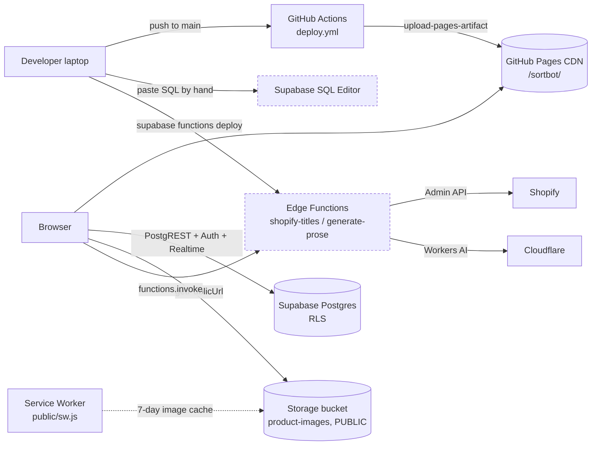
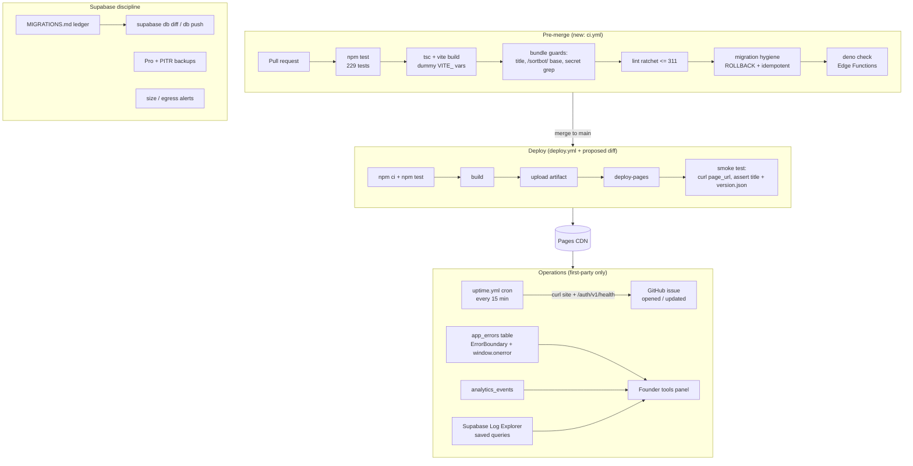

# 06 — DevOps review: deployment, CI/CD, monitoring, reliability, scaling

Reviewed at commit `0cdfacd` (branch `main`, clean tree). Every claim about the
current state cites `file:line`. Nothing in this review was applied to the
database, and no existing file was modified.

Files added alongside this review:

| File | Purpose |
|---|---|
| `.github/workflows/ci.yml` | Pre-merge checks: tests, typed build, bundle guards, lint ratchet, migration hygiene, Deno typecheck |
| `deploy/Dockerfile` | Two-stage static image (node build -> nginx) with a configurable base path |
| `deploy/nginx.conf` | SPA fallback + cache/security headers + `/healthz` |
| `deploy/docker-compose.yml` | The app container, and how to run it beside the official self-hosted Supabase stack |
| `deploy/README.md` | How to use the above, and why Kubernetes is not warranted |

`.github/workflows/deploy.yml` was **not** touched; its changes are proposed as
a diff in §4.3.

---

## 1. Current state, verified

| Area | State | Evidence |
|---|---|---|
| Hosting | Static SPA on GitHub Pages, project path `/sortbot/` | `vite.config.ts:11`, `README.md:5` |
| Deploy trigger | Every push to `main`, plus manual dispatch | `.github/workflows/deploy.yml:5-9` |
| Deploy permissions | `contents: write`, `pages: write`, `id-token: write` | `.github/workflows/deploy.yml:12-15` |
| Deploy concurrency | `group: pages`, no cancel of in-flight | `.github/workflows/deploy.yml:19-21` |
| Build in CD | `npm ci` then `npm run build` (= `tsc -b && vite build`) | `.github/workflows/deploy.yml:41-45`, `package.json:8` |
| Tests in CD | **None** — the 229 tests never run on the deploy path | `.github/workflows/deploy.yml:31-71` |
| Checks on PRs | **None** — `deploy.yml` was the only workflow | `.github/workflows/` contained one file |
| Post-deploy verification | **None** — the job ends at `deploy-pages` | `.github/workflows/deploy.yml:69-71` |
| Build env | 3 `VITE_*` values from Actions secrets, all public by design | `.github/workflows/deploy.yml:56-59`, `README.md` "Security" |
| Backend | Managed Supabase: Postgres + RLS, public Storage bucket, Realtime, 2 Edge Functions | `README.md` "Tech Stack", `src/lib/supabase.ts:10` |
| Migrations | 45 hand-run `.sql` files, no CLI tracking, no ledger | `supabase/migrations/` (45 files), `supabase/migrations/README.md:1` is a one-line stub |
| Edge Functions | Deployed by hand; secrets via `supabase secrets set` | `supabase/functions/shopify-titles/index.ts:129`, `supabase/functions/generate-prose/index.ts:51,56-57` |
| Error tracking | None. One local boundary around Step 2 only; no `window.onerror`/`unhandledrejection` handler exists | `src/App.tsx:210,2790,2811`; repo-wide grep found no global handler |
| Analytics | First-party `analytics_events` + `analytics_summary()` RPC | `supabase/migrations/analytics_events.sql:23`, `src/lib/analytics.ts:1-25` |
| Uptime check | None | no workflow, no external monitor |
| Test suite | 229 tests in 19 files, ~0.9 s — verified locally | `npm test` |
| Lint | 311 problems (295 errors, 16 warnings) — verified locally, matches the AGENTS.md §17 baseline | `npm run lint` |

Two structural facts shape everything below:

1. **There is no server.** The browser talks straight to Supabase
   (`src/lib/supabase.ts:10`). "The app is down" therefore means one of: Pages
   is not serving the bundle, the bundle is broken, or Supabase is unreachable.
   Nothing in between can fail.
2. **Configuration is build-time.** Vite inlines `VITE_*` into the bundle
   (`.github/workflows/deploy.yml:50-55` documents this). A config change is a
   rebuild, and an artifact is environment-specific.

---

## 2. Infrastructure architecture

### 2.1 Today



Dashed = applied by hand, with no record of what was applied where.

### 2.2 Recommended (same topology, gates and feedback added)



Nothing new is introduced as a dependency: the uptime check is a GitHub Actions
cron, error tracking is a Postgres table this project already owns, and
analytics already exists (`src/lib/analytics.ts`). No third-party SaaS.

---

## 3. Deployment workflow

### 3.1 Branch strategy

Current: direct commits to `main`, which is also the production trigger
(`.github/workflows/deploy.yml:5-6`). For a solo founder that is defensible, but
it means every commit is a production deploy with no gate.

Recommended, minimal change:

* `main` = production. Protect it: require the `CI / test / build / lint` check,
  require a PR (a one-person PR is fine and takes 30 seconds), disallow force
  push.
* Short-lived `feat/*` / `fix/*` branches. `ci.yml` runs on both the branch push
  and the PR.
* `staging` = optional long-lived branch for the preview deploy (§3.2).
* Migrations get their own PR whenever possible, so the SQL is reviewed
  separately from the code that depends on it (the code is already written to
  tolerate an unapplied migration — see `src/lib/betaService.ts` `'unavailable'`
  fallback pattern described in AGENTS.md §5).

### 3.2 Preview / staging, given one Pages environment

GitHub Pages gives a repo exactly one site, so a per-PR preview URL is not
available without a second host. Three options, in ascending cost:

1. **Local container preview (zero new infrastructure).** `deploy/docker-compose.yml`
   builds the PR's bundle against a staging Supabase project and serves it on
   `:8088`. Good enough for "does this look right", and it is the same artifact
   the reviewer can hand to someone else via `docker save`.
2. **A second repo as the staging site** — `gerbriel/acadia-staging` with Pages
   enabled, published from the `staging` branch by a small workflow that uses a
   deploy key or a fine-grained PAT. This yields a real URL
   (`https://gerbriel.github.io/acadia-staging/`) and is the cheapest way to get
   "someone else can click it". Note the base path differs, so build it with
   `--base=/acadia-staging/`; `vite.config.ts:11` hardcodes `/sortbot/` when
   `GITHUB_ACTIONS` is set, so the staging workflow must pass `--base` on the
   command line (`npm run build -- --base=/acadia-staging/`), exactly as
   `deploy/Dockerfile` does. Verified locally that this override works.
3. **A `staging` GitHub Environment on the same site** is *not* useful: both
   environments would publish to the same URL, so the second one just
   overwrites production.

Whichever is chosen, **staging must point at a separate Supabase project.**
Sharing one project means staging writes land in production tables, and the
destructive migrations in `supabase/migrations/` (AGENTS.md §5) get tested on
real customer data. A second free-tier project is the right place to rehearse
every migration before it touches production.

### 3.3 Production deploy today, with its gaps

`deploy.yml` is correct as far as it goes — `cache: 'npm'`
(`.github/workflows/deploy.yml:39`), a `pages` concurrency group that does not
cancel in-flight deploys (`:19-21`, deliberately right), and an `environment:`
block so the URL shows in the UI (`:27-29`). The gaps are:

* **No tests before deploy** (`:41-45`). `tsc -b` catches type errors; the 229
  characterization tests — which exist precisely because this app's invariants
  are subtle (CSV golden snapshot, slim() whitelist, grouping conventions) —
  never run on the production path.
* **`contents: write` is unnecessary** (`:13`). The Pages artifact flow needs
  `pages: write` + `id-token: write` only. `contents: read` is enough to check
  out.
* **No post-deploy verification** (`:69-71`). A successful `deploy-pages` step
  means "files uploaded", not "the site renders".
* **No artifact retention setting** (`:64-67`); `upload-pages-artifact` defaults
  to 1 day, which is fine for Pages but leaves nothing to inspect after an
  incident.
* **No build provenance in the bundle.** There is no way to ask a running
  browser which commit it is on, which makes "did my deploy reach you?" and
  Service-Worker staleness reports unanswerable.

---

## 4. CI/CD pipeline

### 4.1 What `ci.yml` adds (new file)

Two jobs, `permissions: contents: read`, concurrency-cancelled per ref.

**Job `verify`:**

1. `npm ci` with the npm cache keyed by `package-lock.json` (`setup-node` cache).
2. `npm test` — 229 tests, ~1 s.
3. `npm run build` with dummy `VITE_*` values. Required: `src/lib/supabase.ts:6-8`
   throws at import time when the two Supabase vars are missing, so a build
   without them fails for the wrong reason. This is also the type gate
   (`tsc -b`).
4. **Build-output verification** — asserts `dist/index.html` contains
   `<title>Acadia</title>` (`index.html:9`) and that assets are emitted under
   `/sortbot/`. The second check is a guard on the invariant in AGENTS.md §1:
   `GITHUB_ACTIONS` is set in any runner, so CI builds with the same base as
   production and a base-path regression fails here instead of 404-ing the live
   site.
5. **Bundle secret-leak guard** — greps `dist/` for `shpat_…`, `service_role`,
   `eyJhbGciOi`, `sk-ant-api`, `sk-proj-`, `SUPABASE_SERVICE_ROLE`. Because CI
   builds with dummy values, any hit means a credential was hardcoded in source.
   This is the one mistake that cannot be undone after a deploy (README
   "Security"). Verified locally against a real build: zero false positives.
6. **Lint ratchet** — runs `npm run lint`, parses the `N problems` line, writes
   it to the job summary, and fails **only if N > 311**. Verified locally:
   parses `311`, exits 0, and emits a notice telling the author to lower the
   baseline when the count drops.
7. **Migration hygiene** — for every `supabase/migrations/*.sql` **changed in
   this PR**, requires a `ROLLBACK` section and either the word `idempotent` or
   `if not exists`. Rationale: these files are applied by hand in the SQL Editor
   (AGENTS.md §5), so the file itself is the only rollback documentation that
   will ever exist. The step also reports a repo-wide baseline as an
   informational notice.

   **Honest calibration:** a repo-wide *blocking* version of this check would
   fail today. Measured across all 45 migrations, only **16 satisfy both rules**;
   29 do not (e.g. `clean_categories.sql`, `shared_workspace_rls.sql`,
   `convert_to_shared_collaborative.sql`, `fix_rls_policies_complete.sql` — all
   of which rewrite RLS policies with no documented undo). Gating on changed
   files makes the rule enforceable immediately and lets the 29 be fixed
   deliberately; gating on everything would make CI red on day one and get
   switched off. The 16/45 number is printed on every run so the debt stays
   visible.

**Job `edge-functions`:** installs Deno via `denoland/setup-deno@v2`
(`continue-on-error`, so a runner without it degrades to a warning) and runs
`deno check` over `supabase/functions/*/index.ts`. These files are Deno, not
Node — `tsc -b` never sees them, so today a type error in
`supabase/functions/shopify-titles/index.ts` (260 lines) is discovered only when
someone runs `supabase functions deploy` by hand. The functions import nothing
remote (both use bare `Deno.serve` and `fetch`, verified: no `import` statements
in either file), so the check needs no network access and no import map.

The `deno check` step is `continue-on-error: true` **for now**, with a comment
saying to remove that line after one green run. Deno is not installed on this
machine, so I could not verify that the two functions currently type-check
clean; shipping it as blocking would risk red PRs for a reason unrelated to the
PR. This is the only intentionally soft gate.

### 4.2 Caching and cost

`setup-node`'s npm cache is the only cache worth having here: `npm ci` is the
slow step (~20-40 s), `vite build` is 1.5 s locally and the test run is under a
second. A Vite build cache would save nothing measurable. Total CI time should
land around 1-2 minutes.

One nuance: `pull_request` + `push: branches-ignore: [main]` means a branch with
an open PR runs CI twice. At ~2 minutes on a public repo that is free; drop the
`push` trigger if PR discipline becomes reliable.

### 4.3 Proposed diff to `deploy.yml` (not applied)

```diff
--- a/.github/workflows/deploy.yml
+++ b/.github/workflows/deploy.yml
@@
-permissions:
-  contents: write
-  pages: write
-  id-token: write
+permissions:
+  # Checkout only needs read. The Pages artifact flow needs pages + id-token.
+  contents: read
+  pages: write
+  id-token: write
@@
       - name: Install dependencies
         run: npm ci
 
+      # Gate the production deploy on the same tests CI runs. 229 tests, ~1 s.
+      # Without this, main deploys whatever type-checks.
+      - name: Unit tests
+        run: npm test
+
       - name: Build
         run: npm run build
         env:
@@
           VITE_STORAGE_LIMIT_GB: ${{ secrets.VITE_STORAGE_LIMIT_GB }}
 
+      # Build provenance the running browser can report back. Lets the smoke
+      # test below prove WHICH build is live, and lets a future client-side
+      # check detect a stale Service Worker / cached index.html.
+      - name: Stamp build version
+        run: |
+          printf '{"commit":"%s","ref":"%s","built_at":"%s","run_id":"%s"}\n' \
+            "$GITHUB_SHA" "$GITHUB_REF_NAME" "$(date -u +%FT%TZ)" "$GITHUB_RUN_ID" \
+            > dist/version.json
+
       - name: Setup Pages
         uses: actions/configure-pages@v4
 
       - name: Upload artifact
         uses: actions/upload-pages-artifact@v3
         with:
           path: './dist'
+          retention-days: 7
 
       - name: Deploy to GitHub Pages
         id: deployment
         uses: actions/deploy-pages@v4
+
+      # Post-deploy smoke test: "files uploaded" is not "the site renders".
+      # Pages propagation takes a few seconds, so retry rather than sleep.
+      - name: Smoke test the live site
+        env:
+          PAGE_URL: ${{ steps.deployment.outputs.page_url }}
+        run: |
+          set -uo pipefail
+          url="${PAGE_URL%/}/"
+          for i in $(seq 1 12); do
+            body=$(curl -fsSL --max-time 20 "$url" || true)
+            if printf '%s' "$body" | grep -q '<title>Acadia</title>'; then
+              echo "OK: <title>Acadia</title> served at $url (attempt $i)"
+              ver=$(curl -fsSL --max-time 20 "${url}version.json" || true)
+              echo "version.json: ${ver:-<not served>}"
+              case "$ver" in
+                *"$GITHUB_SHA"*) echo "Live build matches $GITHUB_SHA" ;;
+                *) echo "::warning::version.json does not report $GITHUB_SHA yet (CDN propagation)" ;;
+              esac
+              # The entry bundle must actually be fetchable under /sortbot/.
+              asset=$(printf '%s' "$body" | grep -oE 'src="[^"]*assets/[^"]+\.js"' | head -1 | sed -E 's/.*src="([^"]+)".*/\1/')
+              if [ -n "$asset" ]; then
+                curl -fsS --max-time 30 -o /dev/null "https://gerbriel.github.io${asset}" \
+                  && echo "OK: entry bundle $asset is served" \
+                  || { echo "::error::entry bundle $asset is NOT served — base path or artifact problem"; exit 1; }
+              fi
+              exit 0
+            fi
+            echo "attempt $i: not live yet"; sleep 10
+          done
+          echo "::error::site did not serve the expected <title> within ~2 minutes of deploy"
+          exit 1
```

Note on ordering: the smoke test runs **after** the deploy, so it detects a bad
release rather than preventing it. That is inherent to Pages — there is no
staging slot to swap. The mitigation is the rollback runbook below, and the fact
that `npm test` now runs before the artifact is built at all.

### 4.4 Rollback runbook (no new tooling)

Rollback is re-deploying the last good commit. Fastest path first:

1. **Re-run the last green deploy (60-90 s).** GitHub -> Actions -> "Deploy to
   GitHub Pages" -> pick the last run whose smoke test passed -> **Re-run all
   jobs**. It checks out that run's commit, rebuilds, and republishes. This
   works even after the Pages artifact has expired, because the re-run rebuilds
   from source.
   *Caveats:* it uses the workflow file **from that commit** (so a rollback past
   a workflow change reverts the workflow too), and it reads secrets **at re-run
   time** (so a rotated `VITE_SUPABASE_ANON_KEY` is picked up — usually what you
   want).
2. **Or `git revert` + push** (90-120 s). Preferred when the bad change must
   also leave `main`, which is nearly always true for anything but a config
   typo. `git revert <sha> && git push` triggers a normal deploy.
3. **Verify:** hard-reload the site, confirm `version.json` reports the expected
   commit, confirm `<title>` renders, and confirm a batch opens from Library.
4. **If the break is data-shaped, not code-shaped** — e.g. a migration changed
   RLS and writes now silently affect 0 rows — code rollback will not fix it.
   Run the migration's `ROLLBACK` section in the SQL Editor. This is exactly why
   `ci.yml` requires one in every new migration, and why the 29 migrations that
   lack one are a real liability.
5. **Never** fix production by editing the `gh-pages` artifact or the Pages
   branch directly; the next push to `main` overwrites it and the fix silently
   disappears.

A caveat unique to this app: the bundle is cached by the browser and there is a
Service Worker installed (`src/main.tsx:11-24`). A rolled-back build reaches
returning visitors only after `index.html` is revalidated — see §7.4.

---

## 5. Supabase operations

### 5.1 Migration discipline — the single largest operational risk

Facts: 45 `.sql` files in `supabase/migrations/`, applied by pasting into the
SQL Editor; `supabase/migrations/README.md:1` is a one-line "Last updated"
stamp; three more migrations live at the repo root
(`ADD_APPLIED_PRESET_ID.sql`, `database_migration_csv_fields.sql`,
`fix_security_warnings.sql`); two files differ only by suffix
(`convert_to_shared_collaborative.sql` and `..._FIXED.sql`), and there is no
record of which one was run. Only 16 of 45 document a rollback.

Consequence: **nobody can currently answer "what is the schema of production?"**
except by inspecting production. That makes onboarding a second environment
(staging), a second developer, or a self-hosted customer install a guessing
exercise.

Recommended, in order, each cheap:

1. **A ledger, today.** Replace the stub `supabase/migrations/README.md` (or add
   `MIGRATIONS.md`) with a table that is the source of truth for what has been
   applied. `ci.yml` already warns when a changed migration is missing from it:

   ```markdown
   | # | File | Applied to prod | Applied to staging | Destructive | Rollback in file | Notes |
   |---|---|---|---|---|---|---|
   | 001 | create_workflow_batches.sql | 2026-02-06 | - | no | no | base tables |
   | 018 | shared_workspace_rls.sql | 2026-04-xx | - | YES (rewrites SELECT policies) | no | superseded by multi_org_tenancy |
   | 031 | multi_org_tenancy.sql | NOT APPLIED | - | YES (replaces policies on 5 tables) | yes | take a backup first |
   | 040 | analytics_events.sql | NOT APPLIED | - | no | yes | needs 031 + beta_signups |
   ```

   Fill "Applied to prod" from the dashboard's SQL history plus
   `information_schema` spot-checks (`select table_name from
   information_schema.tables where table_schema='public'` and
   `select tablename, policyname from pg_policies where schemaname='public'`).
   That one query pair resolves most of the ambiguity in an afternoon.
2. **Number new migrations** `NNN_description.sql` (or keep the existing
   `YYYYMMDD_` style used by `20260426_add_transforms_to_product_images.sql`).
   Dependency order is currently encoded only in prose comments ("Run AFTER
   multi_org_tenancy.sql"), which does not survive a fresh install.
3. **Adopt the CLI without a rewrite.** `supabase/` has no `config.toml`, so the
   project is not linked. Path:
   * `supabase init` + `supabase link --project-ref <ref>`;
   * create a **shadow/staging project** and apply the 45 files there in order
     once, fixing what breaks — this is the real value: it proves the ledger;
   * from then on, author changes locally and use `supabase db diff -f <name>`
     to generate the migration, `supabase db push` to apply to staging, then
     prod;
   * do **not** retro-import the 45 files into CLI history against production —
     `db push` on a mismatched history is how people drop things. Baseline
     instead: mark existing state as applied (`supabase migration repair`) once
     the ledger is trustworthy.
4. **Rehearse every destructive migration on staging.** `multi_org_tenancy.sql`
   replaces the policies on five tables; `shared_workspace_rls.sql` and
   `collaborative_edit_policies.sql` rewrite INSERT/UPDATE/DELETE reachability.
   A mistake here does not throw — it makes writes affect 0 rows, which this app
   partially papers over (`src/lib/workflowBatchService.ts:408-426`).

### 5.2 Backups and PITR

The app has no backup story of its own and the data is not reconstructible: the
in-flight batch lives in `workflow_batches.workflow_state` JSONB, and images are
bytes in Storage.

* **Move to Supabase Pro before external users.** ANALYSIS.md §3.8 already
  concludes this (~$25/mo). It brings daily backups with 7-day retention and
  PITR as an add-on; free-tier projects have neither, and also pause after
  inactivity.
* **Enable PITR** once there is any paying customer. The failure mode this
  protects against is exactly the one this codebase has already suffered: a
  storage/DB cleanup that deleted rows another batch still referenced (the
  reason `src/lib/storageSafety.ts` exists).
* **Storage is not covered by a Postgres backup.** 4,854 files across three user
  folders (AGENTS.md §15, compression run of April 2026). A weekly off-box copy
  is a small script over the same listing loop the compression tool already
  uses; without it, a bucket-level mistake is unrecoverable.
* **Test one restore.** An untested backup is a belief. Restore into a scratch
  project, point a local build at it, open a batch from Library.

### 5.3 Edge Function deploys from CI

Both functions are deployed by hand today. They are small (128 and 260 lines)
but they are the only server-side code, and `verify_jwt` behaviour plus secret
availability differ between "works on my machine" and deployed.

Add a **manually-triggered** workflow (not automatic on every push — a function
deploy is a production change with a different blast radius than a static
bundle):

```yaml
# .github/workflows/functions.yml  (proposed)
name: Deploy Edge Functions
on:
  workflow_dispatch:
    inputs:
      function:
        description: which function to deploy
        required: true
        type: choice
        options: [shopify-titles, generate-prose, both]
permissions:
  contents: read
jobs:
  deploy:
    runs-on: ubuntu-latest
    environment: production        # add required reviewers here
    steps:
      - uses: actions/checkout@v4
      - uses: denoland/setup-deno@v2
        with: { deno-version: v2.x }
      - run: deno check supabase/functions/*/index.ts
      - uses: supabase/setup-cli@v1
        with: { version: latest }
      - env:
          SUPABASE_ACCESS_TOKEN: ${{ secrets.SUPABASE_ACCESS_TOKEN }}
          PROJECT_REF: ${{ secrets.SUPABASE_PROJECT_REF }}
        run: |
          set -euo pipefail
          for f in shopify-titles generate-prose; do
            case "${{ inputs.function }}" in
              both) ;; "$f") ;; *) continue ;;
            esac
            supabase functions deploy "$f" --project-ref "$PROJECT_REF"
          done
```

`SUPABASE_ACCESS_TOKEN` is a personal access token with project-management
scope — treat it as the most dangerous secret in the repo (it can read and
change the project, unlike the anon key). Store it as an **environment** secret
on a protected `production` environment so a fork PR can never reach it, and
rotate it on any laptop change.

### 5.4 Secret inventory and rotation

| Secret | Where it lives | Blast radius | Rotation |
|---|---|---|---|
| `VITE_SUPABASE_ANON_KEY` | Actions secret -> public bundle | None beyond RLS (public by design, `README.md` "Security") | Only if RLS is found to be permissive; requires a rebuild + redeploy |
| `SHOPIFY_ADMIN_TOKEN` | Supabase Function secret (`supabase/functions/shopify-titles/index.ts:122`) | Full store read/write | Rotate in Shopify, `supabase secrets set`, redeploy function. Quarterly |
| Per-org Shopify tokens | `org_shopify_connections.admin_token`, client-write-only | One merchant's store | Merchant re-enters in Workspace -> Shopify |
| `CF_API_TOKEN` | Supabase Function secret (`supabase/functions/generate-prose/index.ts:57`) | Cloudflare Workers AI spend | Rotate in Cloudflare, re-set, redeploy |
| `SUPABASE_SERVICE_ROLE_KEY` | Injected by the platform (`shopify-titles/index.ts:63`) | Total RLS bypass | Rotate only via Supabase; never copy it anywhere |
| `SUPABASE_ACCESS_TOKEN` (proposed) | Actions environment secret | Whole Supabase project | Rotate on laptop change / offboarding |

The `ci.yml` bundle guard is the automated half of this table: it fails the build
if any of these patterns ever reaches `dist/`.

### 5.5 Dashboard alerts worth setting (Supabase built-ins, no third party)

* **Database size** — alert well before the tier limit; `analytics_events` and
  `workflow_batches.workflow_state` are the two tables that grow without bound.
  `analytics_prune(365)` exists (`supabase/migrations/analytics_events.sql`,
  retention section) but is not scheduled — schedule it with `pg_cron` or call
  it monthly.
* **Storage size / egress** — the bucket is public and thumbnails are full-size
  downloads (transforms are Pro-only; `getThumbnailUrl()` deliberately returns
  the plain CDN URL, AGENTS.md §7). Egress is therefore the cost line that will
  surprise first.
* **Auth email rate limits** — sign-up confirmations are on the built-in SMTP
  until a real sender is configured; hitting the cap silently blocks
  registration.
* **Realtime concurrent connections** — support messaging subscribes per session
  (`src/lib/supportService.ts:143`).

---

## 6. Monitoring, within the self-reliance rule

No Sentry, no Datadog, no third-party chat. Everything below is either a
Postgres table this project owns, a Supabase built-in, or a GitHub Actions cron.

### 6.1 First-party error tracking: `app_errors`

Today a render crash outside Step 2 produces a white screen and a console
message nobody sees: the only boundary is `GrouperErrorBoundary`
(`src/App.tsx:210`), used twice (`src/App.tsx:2790,2811`), and a repo-wide grep
finds no `window.onerror` or `unhandledrejection` listener. Silent failure is
also the codebase's documented default (AGENTS.md §13 "Error Handling Pattern").

The migration below follows the exact conventions of
`supabase/migrations/analytics_events.sql`: additive, idempotent, RLS with an
insert-only client, founders-only read via `is_beta_admin()`, and a rollback
section. **Not applied — review, then run in the SQL Editor.**

```sql
-- supabase/migrations/app_errors.sql   (PROPOSED — not applied)
-- First-party error tracking. Same model as analytics_events.sql: the browser
-- writes, only Founding admins read. Run AFTER multi_org_tenancy.sql and
-- beta_signups.sql (needs organizations + is_beta_admin()). Idempotent.
-- Rollback at the bottom.

create table if not exists public.app_errors (
  id          bigint generated always as identity primary key,
  created_at  timestamptz not null default now(),
  kind        text not null check (kind in ('render','window','promise','manual')),
  message     text not null check (char_length(message) between 1 and 500),
  stack       text check (stack is null or char_length(stack) <= 4000),
  component   text check (component is null or char_length(component) <= 120),
  view        text check (view is null or char_length(view) <= 30),
  step        int  check (step is null or step between 1 and 4),
  app_version text check (app_version is null or char_length(app_version) <= 60),
  user_agent  text check (user_agent is null or char_length(user_agent) <= 300),
  session_id  text check (session_id is null or char_length(session_id) <= 64),
  user_id     uuid references auth.users(id) on delete set null,
  org_id      uuid references public.organizations(id) on delete set null,
  batch_id    uuid,
  fingerprint text not null check (char_length(fingerprint) between 8 and 64)
);

create index if not exists app_errors_created_idx on public.app_errors (created_at desc);
create index if not exists app_errors_fp_idx      on public.app_errors (fingerprint, created_at desc);

alter table public.app_errors enable row level security;

grant insert on public.app_errors to anon, authenticated;
grant select on public.app_errors to authenticated;
grant usage on sequence public.app_errors_id_seq to anon, authenticated;

-- Anonymous visitors (landing page): a row, never an identity.
drop policy if exists app_errors_insert_anon on public.app_errors;
create policy app_errors_insert_anon on public.app_errors for insert
  to anon with check (user_id is null and org_id is null);

-- Signed-in users may only stamp their own id.
drop policy if exists app_errors_insert_auth on public.app_errors;
create policy app_errors_insert_auth on public.app_errors for insert
  to authenticated with check (user_id is null or user_id = auth.uid());

-- Founders-only read. No client UPDATE/DELETE at all.
drop policy if exists app_errors_select on public.app_errors;
create policy app_errors_select on public.app_errors for select
  to authenticated using (public.is_beta_admin());

-- Grouped view for the founder panel: one row per fingerprint.
create or replace function public.app_errors_summary(p_days int default 7)
returns jsonb language plpgsql security definer set search_path = public as $$
declare v_days int := greatest(1, least(coalesce(p_days, 7), 90)); result jsonb;
begin
  if not public.is_beta_admin() then
    raise exception 'app_errors_summary: Founding Workspace admins only' using errcode = '42501';
  end if;
  select jsonb_build_object(
    'days', v_days,
    'total', (select count(*) from public.app_errors
              where created_at >= now() - make_interval(days => v_days)),
    'groups', coalesce((select jsonb_agg(g) from (
        select fingerprint, min(message) as message, min(kind) as kind,
               count(*) as occurrences, count(distinct user_id) as users,
               max(created_at) as last_seen, min(created_at) as first_seen,
               max(app_version) as app_version
        from public.app_errors
        where created_at >= now() - make_interval(days => v_days)
        group by fingerprint order by count(*) desc limit 50) g), '[]'::jsonb)
  ) into result;
  return result;
end; $$;

grant execute on function public.app_errors_summary(int) to authenticated;

-- Retention: same shape as analytics_prune.
create or replace function public.app_errors_prune(p_keep_days int default 90)
returns bigint language plpgsql security definer set search_path = public as $$
declare v_deleted bigint;
begin
  if not public.is_beta_admin() then
    raise exception 'app_errors_prune: Founding Workspace admins only' using errcode = '42501';
  end if;
  delete from public.app_errors
  where created_at < now() - make_interval(days => greatest(7, coalesce(p_keep_days, 90)));
  get diagnostics v_deleted = row_count;
  return v_deleted;
end; $$;

grant execute on function public.app_errors_prune(int) to authenticated;

-- ============================================================================
-- ROLLBACK (manual)
-- ============================================================================
-- drop function if exists public.app_errors_prune(int);
-- drop function if exists public.app_errors_summary(int);
-- drop table if exists public.app_errors;
```

Client reporter, modelled on `src/lib/analytics.ts` (same `available` latch so a
missing table silently no-ops, same DNT/localhost skip, same session id):

```ts
// src/lib/errorReporter.ts   (PROPOSED — not created)
import { supabase } from './supabase';
import { getSessionId, shouldTrack } from './analytics';

type Kind = 'render' | 'window' | 'promise' | 'manual';
let available = true;                       // latches off if app_errors.sql is unapplied
let ctx: { userId: string | null; orgId: string | null; step?: number; batchId?: string | null } =
  { userId: null, orgId: null };
const seen = new Map<string, number>();     // fingerprint -> last sent (ms)
const DEDUPE_MS = 60_000;                   // one row per fingerprint per minute
const MAX_PER_SESSION = 25;                 // a render loop must not DoS the table
let sent = 0;

export function setErrorContext(next: Partial<typeof ctx>) { ctx = { ...ctx, ...next }; }

/** Stable-ish group key: kind + message + first stack frame. No PII. */
export function fingerprint(kind: Kind, message: string, stack?: string): string {
  const frame = (stack ?? '').split('\n')[1]?.trim().slice(0, 120) ?? '';
  let h = 5381;
  for (const ch of `${kind}|${message.slice(0, 200)}|${frame}`) h = ((h << 5) + h + ch.charCodeAt(0)) | 0;
  return `fp${(h >>> 0).toString(36)}`;
}

export async function reportError(kind: Kind, err: unknown, extra?: { component?: string; view?: string }) {
  if (!available || sent >= MAX_PER_SESSION) return;
  if (!shouldTrack({ hostname: location.hostname, doNotTrack: navigator.doNotTrack,
                     forced: localStorage.getItem('sortbot_analytics_force') === '1' })) return;

  const e = err instanceof Error ? err : new Error(String(err));
  const fp = fingerprint(kind, e.message, e.stack);
  const now = Date.now();
  if ((seen.get(fp) ?? 0) > now - DEDUPE_MS) return;
  seen.set(fp, now);
  sent++;

  const { error } = await supabase.from('app_errors').insert({
    kind, message: e.message.slice(0, 500), stack: (e.stack ?? '').slice(0, 4000),
    component: extra?.component ?? null, view: extra?.view ?? null,
    step: ctx.step ?? null, batch_id: ctx.batchId ?? null,
    app_version: __APP_VERSION__ ?? null,          // or fetch('version.json') once at boot
    user_agent: navigator.userAgent.slice(0, 300),
    session_id: getSessionId(sessionStorage), user_id: ctx.userId, org_id: ctx.orgId,
    fingerprint: fp,
  });
  if (error) available = false;                     // table missing / RLS — stop trying
}

/** Install once from main.tsx, before createRoot. */
export function installGlobalErrorHandlers() {
  window.addEventListener('error', (ev) => { void reportError('window', ev.error ?? ev.message); });
  window.addEventListener('unhandledrejection', (ev) => { void reportError('promise', ev.reason); });
}
```

Wiring (three small edits, each additive):

1. `src/main.tsx` — call `installGlobalErrorHandlers()` before `createRoot`.
2. Add a top-level `<AppErrorBoundary>` around `<App />` that calls
   `reportError('render', error, { component: info.componentStack })` and renders
   a "something broke, reload" panel. `GrouperErrorBoundary` (`src/App.tsx:210`)
   already has the right shape to copy — and should also call `reportError`
   instead of only `console.error` (`src/App.tsx:217`).
3. Keep `setErrorContext({ step, batchId })` in sync where the step changes, so
   a crash report says which of the four steps produced it.

Read it back in the existing founder panel next to Analytics
(`src/components/AnalyticsPanel.tsx`) via `app_errors_summary(7)` — one RPC, same
pattern as `analytics_summary`.

**Cost of not doing this:** today the only error signal is a user writing into
the first-party support inbox. That is a real signal — but it arrives hours
late, only from users who bother, and without a stack.

### 6.2 Supabase built-in logs

Free and already collecting; nobody is reading them. Save these as Log Explorer
queries and check them weekly:

* **5xx and RLS denials on PostgREST** — the "writes silently affect 0 rows"
  class of failure that this codebase has hit repeatedly
  (`src/lib/workflowBatchService.ts:330,408-426`):
  ```sql
  select timestamp, event_message, request.path, response.status_code
  from edge_logs cross join unnest(metadata) m
       cross join unnest(m.request) request cross join unnest(m.response) response
  where response.status_code >= 400
  order by timestamp desc limit 100;
  ```
* **Edge Function invocations and errors** (`function_edge_logs`) — is
  `shopify-titles` being called, and is it 503-ing?
* **Auth failures** (`auth_logs`) — sign-up/sign-in breakage is invisible
  otherwise.
* **Slow queries** — the dashboard's Query Performance view; watch
  `workflow_batches` JSONB reads and the paginated `product_images` scans
  (`src/lib/libraryService.ts:22-23`).

Log **drains** (Pro) can push these into the project's own Postgres if the
founder wants them queryable beside `app_errors` — still first-party.

### 6.3 Uptime check as a GitHub Actions cron

No third-party monitor. A scheduled workflow curls the site and the Supabase
auth health endpoint, and opens (or updates) a GitHub issue on failure. Ready to
save as `.github/workflows/uptime.yml` — left as a proposal because it needs
`issues: write` and starts billing minutes as soon as it lands:

```yaml
name: Uptime
on:
  schedule:
    - cron: '*/15 * * * *'      # GitHub may delay or skip runs under load
  workflow_dispatch:
permissions:
  contents: read
  issues: write
concurrency:
  group: uptime
  cancel-in-progress: false
jobs:
  probe:
    runs-on: ubuntu-latest
    timeout-minutes: 5
    steps:
      - name: Probe the site and Supabase
        id: probe
        env:
          SITE: https://gerbriel.github.io/sortbot/
          SUPABASE_URL: ${{ secrets.VITE_SUPABASE_URL }}
          SUPABASE_ANON_KEY: ${{ secrets.VITE_SUPABASE_ANON_KEY }}
        run: |
          set -uo pipefail
          fails=""
          body=$(curl -fsSL --max-time 25 "$SITE" || true)
          printf '%s' "$body" | grep -q '<title>Acadia</title>' \
            || fails="${fails}site: <title> missing or page unreachable"$'\n'
          # GoTrue health: 200 without a session. Cheap, no data touched.
          code=$(curl -s -o /dev/null -w '%{http_code}' --max-time 25 \
                  -H "apikey: $SUPABASE_ANON_KEY" "$SUPABASE_URL/auth/v1/health" || echo 000)
          [ "$code" = "200" ] || fails="${fails}supabase auth health: HTTP ${code}"$'\n'
          # PostgREST reachability (an unauthenticated HEAD is enough).
          code=$(curl -s -o /dev/null -w '%{http_code}' --max-time 25 \
                  -H "apikey: $SUPABASE_ANON_KEY" "$SUPABASE_URL/rest/v1/" || echo 000)
          case "$code" in 200|401|404) ;; *) fails="${fails}postgrest: HTTP ${code}"$'\n' ;; esac
          if [ -n "$fails" ]; then
            { echo "failed=true"; echo "detail<<EOF"; printf '%s' "$fails"; echo "EOF"; } >> "$GITHUB_OUTPUT"
          else
            echo "failed=false" >> "$GITHUB_OUTPUT"
          fi
      - name: Open or update the incident issue
        if: steps.probe.outputs.failed == 'true'
        uses: actions/github-script@v7
        with:
          script: |
            const title = 'Uptime check failing';
            const body = `Probe at ${new Date().toISOString()} (run ${context.runId}):\n\n\`\`\`\n${{ toJSON(steps.probe.outputs.detail) }}\n\`\`\``;
            const { data: open } = await github.rest.issues.listForRepo({
              ...context.repo, state: 'open', labels: 'uptime' });
            if (open.length) {
              await github.rest.issues.createComment({ ...context.repo, issue_number: open[0].number, body });
            } else {
              await github.rest.issues.create({ ...context.repo, title, body, labels: ['uptime'] });
            }
      - name: Close the incident issue when healthy
        if: steps.probe.outputs.failed == 'false'
        uses: actions/github-script@v7
        with:
          script: |
            const { data: open } = await github.rest.issues.listForRepo({
              ...context.repo, state: 'open', labels: 'uptime' });
            for (const i of open) {
              await github.rest.issues.createComment({ ...context.repo, issue_number: i.number,
                body: `Recovered at ${new Date().toISOString()} (run ${context.runId}).` });
              await github.rest.issues.update({ ...context.repo, issue_number: i.number, state: 'closed' });
            }
```

Honest limits: `schedule` is best-effort (runs can be delayed 10+ minutes or
skipped when Actions is busy), it cannot detect a partial outage that only
affects signed-in users, and it will not catch a broken RLS policy. It is a
liveness check, not an SLO monitor. Notification comes from GitHub's own issue
emails — no third party.

### 6.4 Business health from the existing analytics

`analytics_events` + `analytics_summary()` already track the funnel Beta Signup
-> Account Created -> Batch Created -> CSV Exported
(`src/lib/analytics.ts:52`). Treat `CSV Exported` per day as the **real
availability signal**: it is the one event that proves upload, grouping,
description and export all worked end to end for a real user. A day with
sessions but zero exports is an incident even when every probe is green.

---

## 7. Reliability

### 7.1 When Supabase is unreachable

There is no fallback path — the browser is the only client. Behaviour today:

* **At boot:** `src/lib/supabase.ts:6-8` throws if the env vars are missing
  (build-time problem, not an outage). If the network is down, auth
  `getSession()` fails and the app is stuck on the loading screen or the Auth
  screen.
* **Mid-session:** the app keeps working locally to a surprising degree. The
  four item arrays live in `workflowStore` (AGENTS.md §8), so grouping and
  editing continue; the 2 s debounced auto-save just fails
  (`src/App.tsx:1906`), and a synchronous localStorage backup of the current
  items was already written before the network call
  (`src/App.tsx:1829`). Images already in the Service Worker cache still render
  (`public/sw.js:66-99`, which returns a stale entry on network error at
  `public/sw.js:96`).
* **What is actually lost:** anything not in that localStorage backup — and the
  backup is `ultraSlimForBackup`, 7 fields (AGENTS.md §11). Descriptions,
  prices and tags typed during the outage are held in memory only until the next
  successful save.
* **Gap worth closing:** the user is never told. Auto-save failure is silent, so
  someone can dictate 30 listings during an outage, close the tab, and lose
  them. A single "changes are not saving" banner driven by consecutive auto-save
  failures is the highest-value reliability fix in this review, and it needs no
  infrastructure.

### 7.2 RLS-blocked writes that return 0 rows

The most dangerous failure mode in this stack, because it is not an error. An
UPDATE the policy disallows affects 0 rows and returns success. The codebase has
already been burned and now handles it explicitly: `autoSaveWorkflowBatch`
distinguishes "row is gone" from "row exists but RLS blocked us"
(`src/lib/workflowBatchService.ts:408-426`) instead of forking a duplicate
batch, `deleteWorkflowBatch` warns when a delete affects 0 rows
(`src/lib/workflowBatchService.ts:330`), and deletes are recorded in a
localStorage tombstone registry so a blocked delete cannot resurrect a batch
(`src/lib/workflowBatchService.ts:54,62,82,334,444`).

Operational consequences:

* Every RLS migration must be rehearsed on staging with a **non-owner**
  account — owner-only testing passes trivially.
* `app_errors` (§6.1) should receive an explicit `reportError('manual', ...)`
  from the 0-rows branches; they are currently `console.warn` only.
* Before debugging any duplicate-batch report, confirm which RLS state
  production is in (AGENTS.md §16 flags this as unverified).

### 7.3 Auto-save and the localStorage backup

Debounce is 2000 ms with an in-flight mutex (`src/App.tsx:1853-1857,1906`), and
the mutex exists because two concurrent saves both seeing "0 rows updated" used
to create duplicate batches. Do not reduce the debounce (AGENTS.md §11). The
localStorage keys are load-bearing and renaming any of them drops user work
(AGENTS.md §1) — worth repeating here because it is an *operational* hazard, not
just a coding one: a well-meaning "rebrand the storage keys to acadia_*" commit
would silently discard every in-progress batch on the next load.

### 7.4 Service Worker and cache staleness after a deploy

The Service Worker is registered from `src/main.tsx:11-24` and scoped to the
Vite base path. It intercepts **only** Supabase Storage image URLs
(`public/sw.js:32,58`) — it does not cache the app shell, so it cannot serve a
stale bundle. `skipWaiting()` (`public/sw.js:37`) and `clients.claim()`
(`public/sw.js:45`) make a new SW take over immediately, and old cache versions
are pruned on activate (`public/sw.js:147-154`).

Residual staleness risks, in order:

1. **`index.html` caching by the Pages CDN / browser.** This is the real one.
   Returning visitors keep the old hashed asset URLs until `index.html` is
   revalidated. Pages controls that header, so the fix is client-side: fetch
   `version.json` (§4.3) on boot, compare to the built-in version, and show a
   "new version available — reload" prompt. Cheap, no infrastructure, and it
   also makes `app_errors.app_version` meaningful.
2. **Image cache TTL.** 7 days (`public/sw.js:29`) with
   stale-while-revalidate. After a crop re-upload to the *same* storage path
   (AGENTS.md §15), a user can see the pre-crop image until the background
   refresh lands. To bust it deliberately, bump `CACHE_NAME`
   (`public/sw.js:28`) — the activate handler deletes every other cache name.
   Note that bumping it discards all 4,854 cached images, so do it only when the
   cache is actually wrong.
3. **A SW that fails to register** is non-fatal by design
   (`src/main.tsx:19-22`): the app just revalidates every image.

### 7.5 Other reliability affordances already present

* Image loads retry 3x with backoff and a cache-busting query
  (`src/components/LazyImg.tsx:12,41-47`) — a workaround for
  `ERR_QUIC_PROTOCOL_ERROR`, i.e. transient CDN failure is already tolerated.
* Uploads are TUS-resumable in 6 MB chunks (`src/lib/tusUpload.ts`), chosen for
  380-1500-image batches on rural connections — the single most
  outage-sensitive operation in the product is also the best protected.
* Realtime has a polling fallback for support messaging
  (`src/lib/supportService.ts:137-152`).
* Feature-flag-by-probe: services return `'unavailable'` when their migration
  has not been run (`src/lib/betaService.ts`, `src/lib/shopifyConnectionService.ts`,
  `src/lib/imageRowSync.ts` `stage4ColumnsAvailable()`), so code deploys are
  decoupled from SQL deploys. This is genuinely good release engineering and
  should stay the pattern for every new table.

---

## 8. Scaling

### 8.1 Frontend

Pages + CDN scales past any realistic user count for this product. The relevant
limits are per-session, not per-fleet: the entry bundle is 1.24 MB raw / 361 kB
gzip (measured via `npm run build`), plus a 361 kB lazy chunk for the built-in
brand vocabulary that only loads when the Brands tab opens (AGENTS.md §15).
Acceptable for a daily-driver tool on desktop; a code-split of the 1.24 MB entry
chunk is a performance task, not an ops one.

### 8.2 Supabase compute and plan

* **Free tier is not viable for production.** Projects pause after inactivity,
  there are no backups, and storage transforms are unavailable — which is why
  `getThumbnailUrl()` returns full-size CDN URLs (AGENTS.md §7). Pro (~$25/mo)
  is the day-one cost and unlocks real thumbnails, daily backups and PITR.
* **Compute:** the workload is thin — mostly single-row upserts and a few
  paginated scans. The micro instance suffices until the `products` /
  `product_images` tables reach millions of rows. Watch the dashboard's Query
  Performance view rather than guessing.
* **Connections:** PostgREST pools server-side and the app opens no direct
  Postgres connections, so per-user connection exhaustion is not a realistic
  failure mode. If direct Postgres access is ever added (a maintenance script,
  a cron job), route it through Supavisor and cap the pool — `scripts/*.mjs` use
  the JS client today, which is the right choice.

### 8.3 Storage and egress — the real cost line

4,854 files, all already compressed to ~400 kB average (AGENTS.md §15: 2,260 MB
saved, 89% reduction). That is roughly 2 GB of objects. The problem is not
storage, it is **egress**: the bucket is public, thumbnails are full-size
downloads, and Step 2 renders hundreds of images per session. One user opening a
500-image batch pulls ~200 MB, mitigated only by the 7-day Service Worker cache
(`public/sw.js:29`) and `loading="lazy"`.

Levers, cheapest first:

1. Keep the SW cache (it is doing most of the work already).
2. Move to Pro and switch `getThumbnailUrl()` to real transform URLs — a
   150 px thumbnail is ~10 kB instead of ~400 kB, a 40x reduction on the
   dominant traffic pattern. This is both a cost and a latency win.
3. Then privatize the bucket with signed URLs (README "Known limitation") —
   which is a security fix that happens to interact with caching, so sequence it
   after the transform switch and re-measure.

### 8.4 API shape limits already handled

* **PostgREST caps responses at 1000 rows.** The two big reads paginate
  explicitly (`src/lib/libraryService.ts:22-23,59,94-95,121`). Any new
  full-table read must do the same or it silently truncates.
* **URL length on `IN()` lists.** Chunked at 100 IDs (AGENTS.md §11); 794+ IDs
  in one clause returns 400.
* **Realtime:** one presence channel plus a per-session support channel
  (`src/lib/supportService.ts:143`). Concurrent-connection limits are
  plan-bound; the polling fallback means an exceeded limit degrades rather than
  breaks.
* **Edge Functions:** `shopify-titles` paginates Shopify 250/page with a
  200-page cap (AGENTS.md §5). A merchant with >50k products silently truncates
  the dedup set — a correctness cliff worth an explicit log line.

### 8.5 Multi-tenancy readiness

`multi_org_tenancy.sql` is code-complete but, per AGENTS.md §16, **not yet
applied**. Until it is, every workspace shares one dataset. That is the single
biggest blocker to onboarding a second paying customer, and it is a *migration*
task, not a code task — which is exactly why §5.1's ledger and §3.2's staging
project matter more than anything else in this review.

---

## 9. Production deployment checklist

### Pre-deploy

- [ ] `npm test` green locally (229 tests) and `npm run build` clean.
- [ ] `npm run lint` problem count <= 311.
- [ ] PR has a green `CI / test / build / lint` check.
- [ ] If the change touches a migration: it has a ROLLBACK section, it has been
      run on the staging project, and the ledger row is filled in.
- [ ] If the change touches an Edge Function: `deno check` clean, and the
      function's secrets exist in the target project.
- [ ] If the change touches storage-key names, `slim()` fields, or RLS: re-read
      AGENTS.md §18 "Do Not" first.

### Deploy

- [ ] Merge to `main`; watch the `Deploy to GitHub Pages` run.
- [ ] Confirm `npm test` ran in the deploy job (after the §4.3 diff).
- [ ] Confirm the smoke test passed and `version.json` reports the new commit.

### Post-deploy (5 minutes, manual — the smoke test only proves the shell loads)

- [ ] Hard-reload the live site; sign in.
- [ ] Open a batch from Library; confirm images render (not grey placeholders).
- [ ] Upload 2 images, group them, assign a category.
- [ ] Open Step 3 on an existing listing; confirm fields hydrate.
- [ ] Download a CSV; confirm the row count matches the listing count.
- [ ] Check `app_errors` (once §6.1 is applied) for new fingerprints in the last
      hour.
- [ ] Check the Supabase Log Explorer 4xx/5xx query.

### Rollback

- [ ] Decide: re-run the last green deploy, or `git revert` + push (§4.4).
- [ ] If a migration is implicated, run its ROLLBACK section in the SQL Editor —
      code rollback alone will not fix a policy change.
- [ ] Re-run the post-deploy checklist.
- [ ] Write what happened into the incident issue the uptime workflow opened (or
      open one) — it is the only incident record this stack has.

### On-call (one person, realistically)

- [ ] Uptime workflow failures arrive as GitHub issue emails.
- [ ] User-visible breakage arrives through the first-party support inbox
      (`src/lib/supportService.ts`) — check it daily.
- [ ] Weekly: `analytics_summary(7)` (is `CSV Exported` still non-zero?),
      `app_errors_summary(7)`, Supabase database/storage size, and the
      Log Explorer 4xx/5xx query.
- [ ] Monthly: `analytics_prune(365)`, `app_errors_prune(90)`, verify one
      backup restores, review secret rotation dates (§5.4).

---

## 10. What I could not verify

* **`deno check` on the two Edge Functions.** Deno is not installed on this
  machine. The step is `continue-on-error: true` with an instruction to make it
  blocking after one green run.
* **`docker build` / `docker compose up`.** Docker was not available, so
  `deploy/Dockerfile` and `deploy/nginx.conf` are reasoned, not executed. The
  two mechanisms most likely to be wrong were verified another way: the
  `npm run build -- --base=/x/` override was run locally and does rewrite asset
  URLs, and the `nginx` `add_header` inheritance rule (headers do not inherit
  into a location that sets its own) is handled by repeating the security
  headers per location.
* **Which migrations are actually applied to production.** Not knowable from the
  repo; `supabase/migrations/README.md:1` is a one-line stub. §5.1 gives the
  queries to reconstruct it. This also means AGENTS.md §16's "migration not yet
  run" entries could not be confirmed.
* **Whether Supabase is on Free or Pro**, and whether PITR is enabled.
  `VITE_STORAGE_LIMIT_GB` defaults to 100 in code (`src/App.tsx:2638`), which
  hints at Pro, while ANALYSIS.md §3.8 describes free-tier limits — the
  dashboard is the only authority.
* **GitHub repo settings** — branch protection, environment reviewers, Pages
  source, and which Actions secrets exist. All recommendations in §3.1 and §5.3
  assume they can be set by the repo owner.
* The `app_errors` migration and `errorReporter.ts` are **proposals in this
  document only**: no SQL was run and no client file was created.
