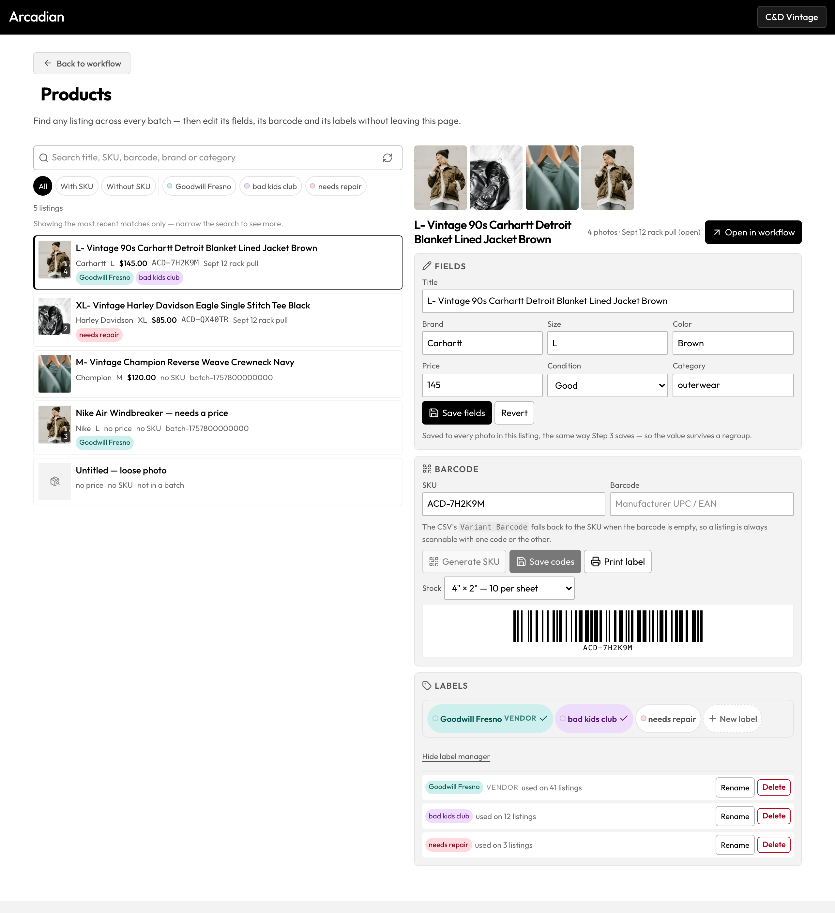
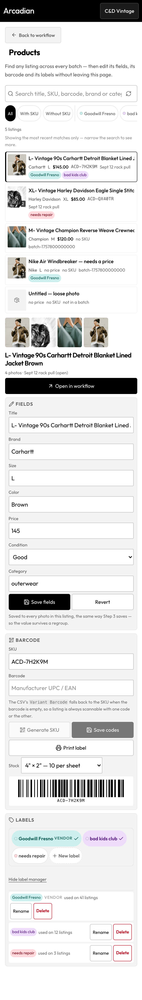

# 21 — Products: pull one listing out of any batch, and CRUD its labels and barcodes

*Sept 2026. Nothing committed. No migration written or run — every table this uses already exists.*

The founder's request, verbatim: **"Want to be able to pull individual products, and also CRUD labels and barcodes."**

---

## 1. Why there was nowhere to go

Every surface in this app is batch-shaped, and that was never a decision — it is what falls out of a workflow
whose unit is "a session of photos":

| Surface | What it operates on |
|---|---|
| Step 3 | the open batch, one listing at a time, by group index |
| Labels | the open batch |
| Scan | any product by SKU — but **refused to open one outside the open batch** (§14 #45) |
| Library | batches, groups and images, as *rows to open or delete* |

So a reseller holding a garment whose name they remember, but not which of forty batches it was photographed in,
had one route: open the Library, guess, open a batch, page through Step 3. And the thing they most often want to
do to it — give it a SKU, correct a price, stick a vendor label on it — is exactly the thing that does not need
the whole batch loaded.

`'products'` is now an `ActiveView`, available to **every member** (not founder-gated), beside Library in the Work
group of `navItems`.

---

## 2. What was built

```
src/lib/productSearchService.ts        NEW  the cross-batch search + the pure rows→listings reduction
src/lib/productSearchService.test.ts   NEW  30 tests
src/components/ProductsView.tsx        NEW  the page (finder + detail + LabelManager + print sheet)
src/components/ProductsView.css        NEW
src/components/ProductsView.test.tsx   NEW  21 tests
src/lib/labelsService.ts               +2 functions (setProductCodes, countLabelUsage) — additive only
src/lib/testing/supabaseMock.ts        + .or() on the builder (test-only, additive)
src/components/BarcodeScannerView.tsx  the other-batch re-route only
src/App.tsx                            the union member, the lazy view, navItems, two handlers, the scanner prop
```

---

## 3. The decisions that carry it

### 3.1 `escapeIlikeTerm` — two hazards, two different treatments

A PostgREST `or=(...)` value sits inside a grammar (`,` separates filters, `.` separates
`column.operator.value`, `()` groups, `:` casts) *and* inside a `LIKE` pattern. The instinct is to strip every
special character. That is wrong for the first set and right for the second:

- **Grammar characters are handled by QUOTING, not stripping.** PostgREST lets a value be double-quoted, and
  inside those quotes `,` `.` `(` `)` `:` are literal. So `"Levi's 501, 32x34 (deadstock)"` still matches the title
  it names. What the function escapes is the two characters that could break *out* of the quotes — `\` and `"` —
  which is what closes the filter-injection (`x,id.eq.<uuid>` would otherwise have added a filter of the user's
  choosing). A test asserts exactly that: after escaping, splitting on the grammar's own separator still yields
  one clause per column.
- **`*` and `%` are dropped**, because either one makes the search match every row — including one pasted in from
  a copied description, silently.
- **`_` is kept.** It is a LIKE metacharacter, but it matches any single character *including itself*, so a SKU or
  filename containing one still finds itself, and the worst it can do is match one extra row.

### 3.2 Rows are photos; a listing is a group of them

`groupRowsIntoListings` is pure and separately tested. It is the DB-row twin of `buildGroupArray`, and it inherits
the same tolerance (§11): the leader is the row whose `id === product_group`, and when that row is absent — the
legacy fresh-UUID group — the first row stands in. Fields are coalesced **leader-first**, the way the CSV exporter
coalesces a group, so a blank leader photo cannot make a listing look untitled and unpriced. Photos are
position-ordered within a member, leader's first, de-duplicated by the URL that will actually be rendered, and
built through `publicImageUrl` (§18 #20 — never an inline `getPublicUrl`).

**A $0 or missing price becomes `null`, never 0.** 0 is what the export gate reads as "priced at nothing", and
what the restore merge would then serve back forever (productService finding 20).

### 3.3 The row limit is ROWS, and the view says so

`searchProducts` reads at most 60 `products` rows. A four-photo listing is four of them, so 60 rows can be 15
listings — and the alternative, paginating, would let the group reduction split a listing across a page boundary
and show it twice, half-populated each time. A visible cap ("Showing the most recent matches only — narrow the
search to see more.") is the better failure, so the result carries a `truncated` flag and the page renders it.

### 3.4 It never writes the workflow store

Step 3 already has two debounced writers into `processedItems` plus a keepalive unload flush. A third writer from
another page, racing them, is how a persistence saga starts. So:

```
ProductsView  →  syncGroupFieldsToDatabase (the SAME writer Step 3 uses)  →  products
              →  onListingEdited(batchId, groupId, patch)  →  App  →  the four store arrays
```

App mirrors it **only when that batch is the one open**, and triggers no auto-save — none of these fields is in the
`slimForWorkflowState` whitelist, so `workflow_state` has nothing to say about them.

Using `syncGroupFieldsToDatabase` rather than a bespoke update is the point: it writes the group LEADER (the row
`handleOpenBatch` reads back) and mirrors onto every member in one `.in()`, so no later regroup can strand the
edit. The patch is carried by minimal `{ id, productGroup, ...patch }` stand-ins, because that function reads only
those keys — the patch it builds is exactly the fields the user changed and nothing else.

The save reports into `saveStatusStore` and **reads the boolean** `syncGroupFieldsToDatabase` returns rather than
`.catch()`-ing it (§18 #41). That function resolves `false` on an RLS refusal; reporting that as success is the
silent-loss bug the September passes spent a week on. A test locks it: a `false` result shows "Could not save"
**and** does not call `onListingEdited`.

### 3.5 `setProductCodes` exists because `updateProduct` swallows the error

`updateProduct` catches the Postgres error, logs it and returns `false` — correct for a field edit, wrong here.
`products_org_sku_uidx` makes a duplicate SKU a **23505**, and *"That SKU is already used by another listing in
this workspace"* is the only message a user can act on; "could not save" leaves them retyping the same code. The
new function also refuses 0 rows as a failure (the lesson of `updateProduct`) and normalises an empty SKU to
`null`, so a blank string cannot occupy the unique index's `where sku is not null` slot.

**Generate SKU** is `ensureSkus([leaderId])` — the leader, because that is the row the scanner and the printed
label read. Uniqueness stays the database's job (§11): no SELECT-first race.

### 3.6 `countLabelUsage` counts listings, not rows

A listing's photos are separate `products` rows, so counting `product_labels` rows would tell a founder that a
four-photo jacket "used" a label four times — and that number appears in a **delete** prompt. The read embeds each
assignment's product group and counts distinct groups. It is paginated (PostgREST truncates at 1,000 rows with no
error, §18 #23) with a `complete` flag, because an undercount here makes a destructive action look safe.

### 3.7 Closing §14 #45

The old refusal — "find it in the Library and open its batch first" — was right only while the batch was
*unknown*. `ScannedProduct` already carried `batch_id`; the Products view reads it off the row. So
`openListingInStep3(productId, batchId?)` now branches, and an other-batch hit routes through the new
`openProductInWorkflow`, which **awaits** `getWorkflowBatch` → `handleOpenBatch` before setting `focusListingId`.

The focus id is released on a 1,200 ms timer there rather than on the next frame, deliberately: PDG is keyed on
`currentBatchId` so it remounts, and its focus effect depends on `groupArray`, which fills as the batch hydrates.
One frame is enough when the batch is already open (that path is unchanged); it is not enough after a batch open.

The toast survives for the one case that genuinely has nowhere to go: a product with no `batch_id` at all.

### 3.8 The print sheet is a second implementation, on purpose

`LabelPrintView` was not touched. A `SingleLabelPrint` block inside ProductsView reads the same
`LABEL_TEMPLATES` geometry and uses the same print technique (`body * { visibility: hidden }`, this subtree painted
back) — which is what lets app chrome outside the component change freely. The two stylesheets coexist without
conflict: neither selector matches the other's subtree.

---

## 4. What the screenshots showed

The harness cannot sign in, so the page was rendered for real — `ProductsView` inside `ToolView` via the
`ui/testUtils` harness with the services mocked — and the resulting DOM was serialised and injected into a page
carrying the production CSS bundle, then photographed at 1280 and 390 and once more under emulated print media.

**Two real defects, neither visible in a code read:**

1. **"LABELS" appeared twice.** The card's own `<h3>` plus `ListingLabelsPicker`'s internal head. Fixed with
   `.pv-card .llp-head { display: none }` — scoped here rather than in the picker, because Step 3 mounts it with no
   heading of its own and still needs it. Nothing is lost: the photo count that head carried is already in the
   detail header.
2. **The truncation note wrapped into a dangling separator.** At 390 the clause `· showing the most recent
   matches only…` broke onto its own line and the leading middot read as a bullet. It is its own `<p>` now.

A third, cosmetic: React sets a `<select>`'s value as a *property*, so the serialised snapshot lost the selected
Condition. That is a fixture artefact, not a bug — the fixture builder restores the `selected` attribute so the
still image shows what the running app shows.

| | |
|---|---|
|  | Desktop: finder left, open listing right, sticky. |
|  | Phone: one column, detail scrolled into view on tap. |
|  | Print media emulated — the label, and nothing else. |

**Measured, not eyeballed:**

- 1280: `documentElement.scrollWidth === clientWidth`; the grid resolves to two columns.
- 390: `scrollWidth === clientWidth`; **zero** controls under 44px; **zero** inputs or selects under 16px; the
  grid is one column. (The filter chips report as "overflowing" the document — they are inside their own
  horizontal scroller, which is the intended behaviour.)
- Print: `.pv-print-wrap` computes to `display: block`, the label box measures **384 × 192 px = exactly 4in × 2in**
  at 96dpi (the `sheet-4x2` template), the barcode SVG is inside it, and **zero** elements outside the sheet
  compute to `visibility: visible`.

---

## 5. Gates

| Gate | Before | After |
|---|---|---|
| `npx vitest run` | 1619 tests / 75 files | **1670 / 77, all green** |
| `npm run build` | clean | **clean** (only the pre-existing "dynamically imported by" warning) |
| `npx eslint .` | 252 | **252 — flat** |

The new chunk is `ProductsView-*.js` at 21.78 kB (7.09 kB gzip), lazy like every other tool view.

Two lint findings were fixed rather than absorbed into the baseline, and the fix is worth keeping: both were
`react-hooks/set-state-in-effect` from a `setSearching(true)` / `setDetailBusy(true)` at the top of an effect.
Both flags are now **derived** — `loadedKey` records which (query, reload) pair the rows belong to, `detailLoadedId`
which listing the panel belongs to — which removes the cascading render *and* removes the way either could get
stuck "loading" if an await threw.

---

## 6. Deliberately not done

- **`'products'` is not on the Home dashboard's Tools grid.** `HomeDashboard.quickActions` is built from
  `navItems` but through an explicit `ORDER` array that names each tile, so a new nav row does not appear there
  automatically. `HomeDashboard.tsx` was out of scope for this pass; adding it is one word in that array.
- **No listing delete.** Destructive, and the Library already owns deletion with its reference-counted storage
  guard (§18 #15). A second delete path is not something to add in a feature pass.
- **No bulk actions.** Assigning SKUs or a label to a filtered set is the obvious next step; it needs a selection
  model, which is a design question rather than a wiring one.
- **`LabelPrintView` and `ListingLabelsPicker` were not edited.** The picker is reused as-is; the print sheet is a
  parallel implementation sharing the template data.
- **No migration.** `listing_labels.sql` is still unrun (§16); pre-migration the labels and SKU surfaces hide or
  say what is missing, and the search, the field editing and Open in workflow all work regardless.

## 7. Still unverified

Everything in a signed-in browser. The page has never been rendered against real rows — the screenshots are the
real component with mocked services against the real CSS bundle, which proves the cascade and the markup, not the
wiring to Supabase. Specifically owed on a real account: a search that actually returns another workspace member's
listings (the RLS assumption), a save landing on a listing whose batch is open (the `onListingEdited` mirror), and
**Open in workflow from a different batch** — the one path here that drives `handleOpenBatch`.
